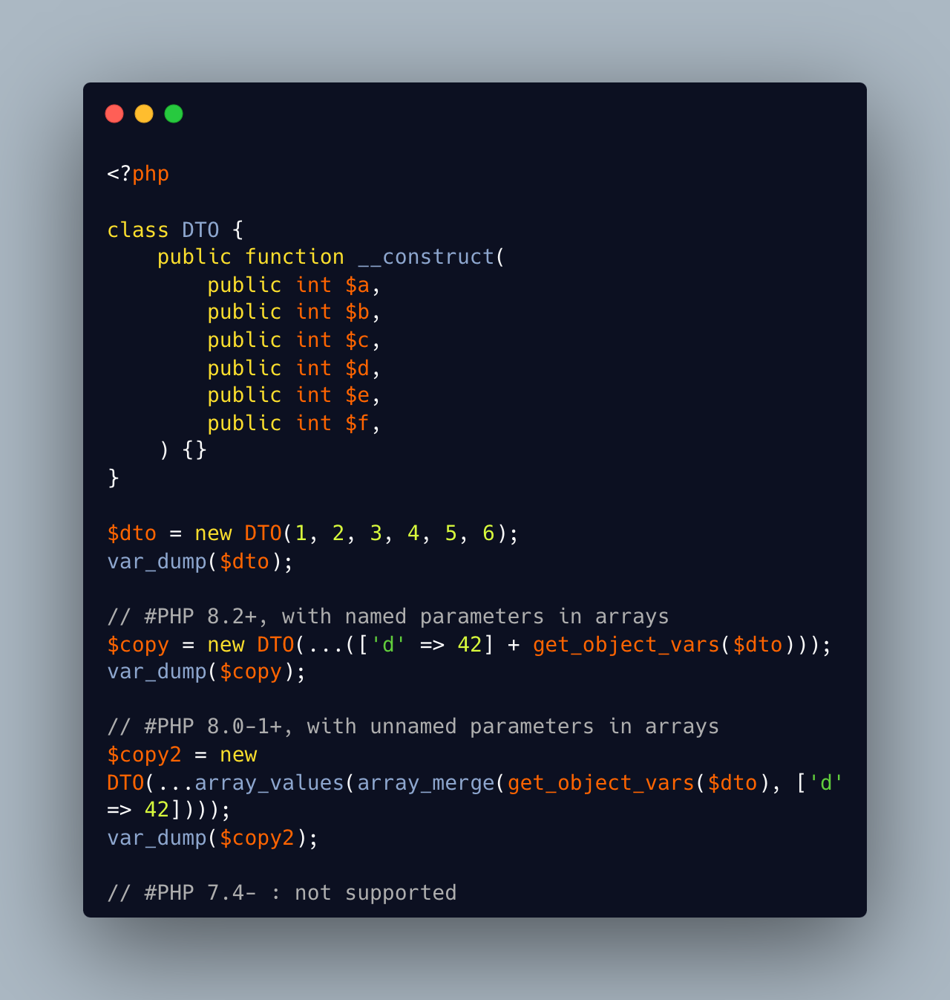
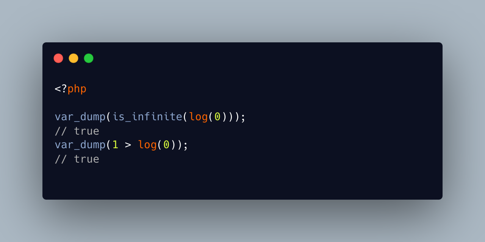
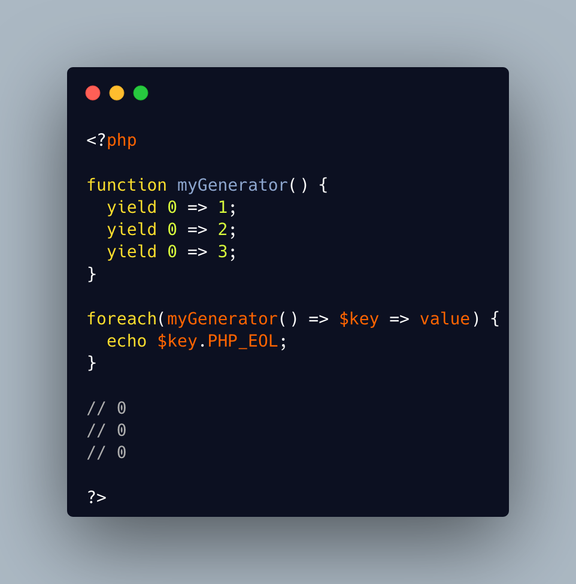

PHP tips and tricks
-------------------

.. _recursive-generator:

Recursive generator
===================
Generator, using yield, may become recursive, when using the ``yield from`` keyword. This recursion is only available when used with a foreach() statement, or a generator using statement such as iterator_to_array(). 

* `Generator syntax <https://www.php.net/manual/en/language.generators.syntax.php>`_

----

.. _void-parameter-in-array_keys():

Void Parameter In array_keys()
==============================
There is a 'void' parameter in #PHP. It is the second argument of array_keys().

That second parameter is often omitted (and unknown). 

If present, it is typed 'mixed' to allow any value to be searched (here, null). 

If absent, array_keys() returns ALL keys. When absent, it is not null, nor any other type. The last one possible is 'void' 

Type is then : void|mixed.

.. image:: images/void_parameter.png

* `Void (PHP manual) <https://www.php.net/manual/en/language.types.void.php>`_

----

.. _unsetting-properties-surprises:

Unsetting Properties Surprises
==============================
Unsetting properties is always a suprise.

First, if the property was typed, it yields a Fatal Error, as the property cannot be accessed before initialization. And, the unset destroyed the property.

Also, checking an unset property with property_exists() is done against the class definition, not the current object state.

* `Double quoted <https://www.php.net/manual/en/language.types.string.php#language.types.string.syntax.double>`_

----

.. _constants-can-be-impossible:

Constants Can Be Impossible
===========================
In this code, the constant ``x2::F`` is not possible, because adding a string and an array will result in Fatal error.

Yet, this will be determined at execution time, and only if the constant is being used.

Since this constant is never used, its code is never executed, and it doesn't yield any error. PHP has optimized the error away.

* `Class Constants <https://www.php.net/manual/en/language.oop5.constants.php>`_

----

.. _quick-dto/vo-copy:

Quick DTO/VO copy
=================
By `Benoit Viguier <https://phpc.social/@b_viguier>`_

A small #PHP trick, combining named parameters, spread and union arrays operators to « easily » create a modified copy of a DTO: https://3v4l.org/ZWX5G#v8.2.10

 It’s fun if you have a lot of parameters, but using a string containing the parameter’s name isn’t really satisfactory 😕

It is possible to extend this syntax to #PHP 8.0+ with a clever array_values() / array_merge(): https://3v4l.org/igrsW

``$copy = new DTO(...(array_values(array_merge(get_object_vars($dto), ['d' => 43]))));``

Now, this extended syntax is an easy prey to property definition order, constructor argument order, and temporary property deletion, unlike your original approach.

* `Function arguments <https://www.php.net/manual/en/functions.arguments.php>`_

----

.. _stealth-generator:

Stealth Generator
=================
By `Frederic Bouchery <https://twitter.com/FredBouchery>`_

The code below has a useless loop. The presence of the ``yield`` keyword in the function body makes it a generator. As such, foreach() will react to ``yield`` calls, though the function returns immediately, without a ``yield``. Hence, the empty loop, even though the function returns an array: indeed, to have the function behave as expected, it is necessary to remove the unreachable ``yield`` call, and then, the foreach() can use the return for the loop.

.. image:: images/stealth-generator.png

* `Generator syntax <https://www.php.net/manual/en/language.generators.syntax.php>`_

----

.. _clone-clone-clone:

Clone Clone Clone
=================
It is possible to chain clone operators : PHP optimize this and skips any intermediate clone. The resulting final object is number 2, so the inner clones were duly ignored. 

On the other hand, it is possible to create a new object from an existing object, but it is not possible to chain the new calls without using parenthesis. 

* `Cloning objects <https://www.php.net/manual/en/language.oop5.cloning.php>`_
* `new <https://www.php.net/manual/en/language.oop5.basic.php#language.oop5.basic.new>`_

----

.. _set-readonly-outside-the-host-class:

Set readonly Outside The Host Class
===================================
PHP 8.1 readonly properties cannot be set from global space, but they can be forced from the host class, just like accessing private properties. 

It doesn't work outside the host class : not in global space, not in a derived class.

Besides that, readonly act as usual : it is only possible to assign the property once.

.. image:: images/readonly_and_private.png

* `Readonly properties <https://www.php.net/manual/en/language.oop5.properties.php#language.oop5.properties.readonly-properties>`_
* `Visibility <https://www.php.net/manual/en/language.oop5.visibility.php>`_
* `Class Invasation <https://php-dictionary.readthedocs.io/en/latest/dictionary.html#class-invasion>`_

----

.. _exception-polyphormism:

Exception Polyphormism
======================
Customs exceptions are classes like any others: they may implements an interface. That interface may be used to catch the exception, even if the interface has nothing to do with exceptions.

.. image:: images/interface_exceptions.png

* `Exceptions <https://www.php.net/manual/en/language.exceptions.php>`_

----

.. _exponential-minus-one:

Exponential Minus One
=====================
You can save typing by using expm1($x) instead of exp($x) - 1. Also, you might have to take care of differences, as both results might be slighltly different depending on the OS you're running it on : Debian is OK, but MacOS says it's different.

.. image:: images/exp_minus_one.png

* `expm1() (PHP manual) <https://www.php.net/expm1>`_
* `expm1() versus exp() - 1 <https://3v4l.org/s2Y5G>`_

----

.. _php-infinity-is-reachable:

PHP Infinity is reachable
=========================
By `Frederic Bouchery <https://twitter.com/FredBouchery>`_

Infinite values are sometimes provided by PHP functions, such as log(0) or exp(PHP_INT_MAX). In that case, beware and do not compare it directly with an integer as a positive is considered bigger than infinite.

* `is_infinite() (PHP manual) <https://www.php.net/is_infinite>`_

----

.. _negative-squares:

Negative Squares
================
Still my favorite PHP bug : literal negative value is squared, and is ... negative. In fact, the ** operator has precedence over the minus operator, and the square is then executed before the negation. Hence, the negative results. It is useful to process, correctly, parenthesises, but not integers. 

.. image:: images/squared_negative.png

* `Operator Precedence <https://www.php.net/manual/en/language.operators.precedence.php>`_

----

.. _negating-an-assignation:

Negating An Assignation
=======================
I always wondered why #PHP allows to NOT a variable on the LEFT side of an assignation.

It makes sense with an iffectation (an assignation in an if)

I'm sure other such expressions are possible, with unary operators. 

Definitely not for me, for readability reasons; same as !$o instanceof X.

.. image:: images/negating_a_variable.png

* `Operator precedence (PHP manual) <https://www.php.net/manual/en/language.operators.precedence.php>`_

----

.. _accessing-a-integer-numeric-separators-inside-a-string?:

Accessing A Integer Numeric Separators Inside A String?
=======================================================
Since #PHP 7.4, there are numeric separators, to make integers more readable. 

They are only for hard-coded literals, so what do you do if you have stored them in a string ?

The solution is to rely on eval(), with a trick : ``$int = eval('return '.$a.';');``. ``return`` is important to return the value that was generated by the code.

Another option is to remove the _ chars, and cast the value to int.

.. image:: images/numeric_separator_string.png

* `Integers: syntax (PHP manual) <https://www.php.net/manual/en/language.types.integer.php#language.types.integer.syntax>`_
* `Eval <https://www.php.net/manual/en/function.eval.php>`_
* `strtr() <https://www.php.net/manual/fr/function.strtr.php>`_

----

.. _don't-forget-to-yield:

Don't Forget To Yield
=====================
It is possible to delegate a generator to another generator.

Just don't call them raw, as nothing will happen.

And don't forget the 'from' part of the keyword, otherwise, it will yield the generator, instead of running it.

.. image:: images/dont_forget_yield.png

* `Generator syntax <https://www.php.net/manual/en/language.generators.syntax.php>`_

----

.. _inconsistent-constructor-signatures:

Inconsistent Constructor Signatures
===================================
PHP enforces that methods have the same signature in a parent class and in a children class. It raises a Fatal Error if not.

Unless for constructors, where the signatures can be different.

This exception to the rule is for legacy purposes, as many source code have varying signatures in a class hierarchy.

Yet, modern OOP recommends to synchronize those signatures, so has to allow instantiation using the same set of arguments.

.. image:: images/phptip-1.png

* `Constructors and Destructors (PHP manual) <https://www.php.net/manual/en/language.oop5.decon.php>`_

----

.. _foreach()-with-all-the-same-keys:

foreach() With All The Same Keys
================================
It is possible for a foreach() loop to produce multiple times the same key. To do so, avoid using arrays, which enforce the unique key.

One need to use a generator or a Traversable class, where the same key is always yielded.

* `foreach (PHP manual) <https://www.php.net/manual/en/control-structures.foreach.php>`_
* `yield (PHP manual) <https://www.php.net/manual/en/language.generators.syntax.php>`_

----

.. _returntypewillchange-is-for-all:

ReturnTypeWillChange Is For All
===============================
ReturnTypeWillChange is an attribute that tells PHP that the return type of the related method is different from the defined by the PHP native methods. In fact, this attribute may also be used on custom interfaces, to skip the type checks.

.. image:: images/void_parameter.png

* `ReturnTypeWillChange (PHP manual) <https://www.php.net/manual/en/class.returntypewillchange.php>`_

----

.. _missing-methods-are-fatal:

Missing Methods Are Fatal
=========================
Calling a missing method is a fatal error. Reading a missing property is a warning and a default to NULL. Writing a missing property is deprecated in PHP 8.3, and will become a fatal error in PHP 9.0.

.. image:: images/missing_methods_are_fatal.png

* `Properties (PHP manual) <https://www.php.net/manual/en/language.oop5.properties.php>`_

----

.. _only-initialize-with-short-assignation-coalesce:

Only Initialize With Short Assignation Coalesce
===============================================
It is not possible to access a property before its initialisation. This is true to both static and normal properties.

While normal properties are initialized at constructor time, static properties might require a check before assignation : in case the property has not been yet assigned, a Fatal error will stop the code execution.

In fact, there is a way : it is the short assignation with coalesce, which will accept to check the NULL value, and only fill it if it is null.  

.. image:: images/initialize_with_coalesce.png

* `Properties <https://www.php.net/manual/en/language.oop5.properties.php>`_

----

.. _keys-are-integers-whenever-possible:

Keys Are Integers Whenever Possible
===================================
Array keys are only strings or integers: the later has priority. So, when storing a string that can be converted to an integer, PHP will do the conversion.

In the case displayed, the keys are French Zip code, which might start with the leading 0. But PHP will convert it into integer, and drop that leading 0. The value is still correctly indexed, but now, the string representation has changed.

* `Array: syntax (PHP manual) <https://www.php.net/manual/en/language.types.array.php>`_

----

.. _an-elephpant-in-the-code:

An elephpant in the code
========================
When you need an elephant in your text, and you have #PHP handy : 

its unicode is 128024 or 0x1F418.

.. image:: images/elephpant.png

* `Double quoted <https://www.php.net/manual/en/language.types.string.php#language.types.string.syntax.double>`_

----

.. _internal-static-call:

Internal Static Call
====================
Trap of the day : one of the calls in bar() will generate a 'Non-static method a::foo() cannot be called statically' error. 

Which one? It is the d::foo(). All other calls are made within the C class : internal calls may use static or normal syntax, while external calls must use the correct call syntax. This allows calls like 'parent::__construct()'. 

When the call to bar() is made with '(new d)', the 'd::foo()' works again. 

* `Late Static Bindings (PHP manual) <https://www.php.net/manual/en/language.oop5.late-static-bindings.php>`_

----

.. _playing-with-integers-limits:

Playing With Integers Limits
============================
Mathematics have the 'Ramanujan Summation', where the infinite sum of all integers is -1/12.

PHP has the integer overflow. Stay away from the PHP_INT_MAX limits. Valid with (int) or intval() with recent #PHP versions.

.. image:: images/playing_with_the_limit.png

* `Operator Precedence <https://www.php.net/manual/en/language.operators.precedence.php>`_
* `8s8q1 <https://3v4l.org/8s8q1>`_

----

.. _strict_types-exceptions:

strict_types Exceptions
=======================
strict_types do not apply to #PHP operators, only on to typed structures. 

Here, concatenation and interpolation all call __toString(), but not foo(). 

As you can see, print() and echo() are safe too, while implode() is not. 

.. image:: images/phptip-1.png

* `declare (PHP manual) <https://www.php.net/manual/en/control-structures.declare.php>`_

----

.. _object-is-not-a-type:

Object is not a type
====================
Such situations always make me smile, yet I am certain several of us will loose time on such a mistake. It is a bit more obvious with integer or string in the instanceof.

.. image:: images/object_is_not_a_type.png

* `Variables (PHP manual) <https://www.php.net/manual/en/language.variables.php>`_

----

.. _keywords-in-namespaces:

Keywords In Namespaces
======================
Since #PHP 8.0, it is possible to use PHP keywords in namespaces.

In PHP 8.0, namespaces are processed independently, for their literal value. Before then, each namespace level was a distinct token, separated by the namespace separator: PHP keyword would then run into a processing conflict. 

The last keyword that one can't still use in a namespace is namespace, when used as the first part of the namespace : it is later replaced dynamically by the current namespace.

.. image:: images/keywords_in_namespaces.png

* `Namespaces (PHP manual) <https://www.php.net/manual/en/language.namespaces.php>`_

----

.. _no-warning-for-unused-variables:

No Warning For Unused Variables
===============================
PHP optimisation in action : undefined variables are only reported when they are used.

first is omitted : no operation

second is skipped : no need to execute 2nd term

third is reporting a warning. 

.. image:: images/variable_optimisation.png

* `Variables (PHP manual) <https://www.php.net/manual/en/language.variables.php>`_

----

.. _instanceof-object:

instanceof Object
=================
object is a type, but it can also be used as a constant name. Then, instanceof will accept it for testing a variable. 

There are some other cases around instanceof, which are surprising upon first read. 

We can use a string in a variable, but not a direct string, a constant nor a ::class.

* `Type Operators (PHP manual) <https://www.php.net/manual/en/language.operators.type.php>`_

----

.. _stdclass-object:

stdClass Object
===============
PHP recycles the previously created stdClass objects ids. The following code displays Object #1, until it is stored in $b. When the stdClass is not stored in a container (variable, property, etc.), it is completely lost and no object counting happens.

Also, PHP's stdClass's constructor ignores all its arguments, as they are not used.

.. image:: images/stdclass_tracking.png

* `The stdClass class (PHP manual) <https://www.php.net/manual/en/class.stdclass.php>`_

----

.. _a-case-of-misplaced-parenthesis:

A Case Of Misplaced Parenthesis
===============================
The closing parenthesis of the in_array() call may be misplaced, yet yield a valid PHP code, and even, a valid business case. This all depends on the actual value given to the $c variable.

It is most probably a bug, given the number of arguments in in_array().

----

.. _checking-for-names-at-different-times:

Checking For Names At Different Times
=====================================
PHP lint detects early to avoid 'redeclared functions', based on local compilation.

php -l => Cannot redeclare mb_substr() 

It doesn't apply to CIT until execution though : 

php => Cannot declare class stdClass

 because the name is already in use

.. image:: images/check_for_names.png

----

.. _not-all-strings-in-arrays:

Not All Strings In Arrays
=========================
Array keys are coerced into strings or integers, while array values are left intact.

Yet, this doesn't apply to array keys, so this code will display an 'Uncaught TypeError: Illegal offset type', even without strict_types.

This code needs an explicit cast to string to work.

.. image:: images/not_all_strings.png

* `Array: syntax (PHP manual) <https://www.php.net/manual/en/language.types.array.php>`_
* `__toString() Magic Method <https://www.php.net/manual/fr/language.oop5.magic.php#object.tostring>`_

----

