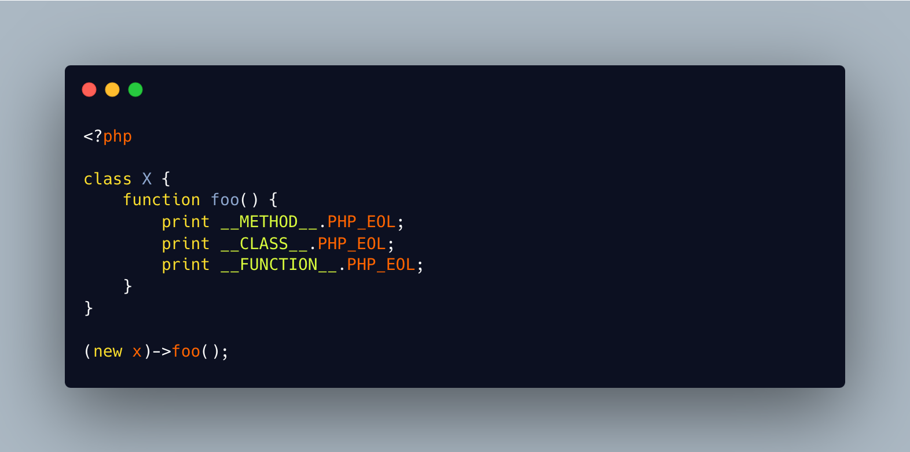

.. _function-name-in-a-method:

Function Name In A Method
-------------------------

.. meta::
	:description:
		Function Name In A Method: The magic constants give information on the context of execution of the code.
	:twitter:card: summary_large_image
	:twitter:site: @exakat
	:twitter:title: Function Name In A Method
	:twitter:description: Function Name In A Method: The magic constants give information on the context of execution of the code
	:twitter:creator: @exakat
	:twitter:image:src: https://php-tips.readthedocs.io/en/latest/_images/FunctionNameInAMethod.png
	:og:image: https://php-tips.readthedocs.io/en/latest/_images/FunctionNameInAMethod.png
	:og:title: Function Name In A Method
	:og:type: article
	:og:description: The magic constants give information on the context of execution of the code
	:og:url: https://php-tips.readthedocs.io/en/latest/tips/FunctionNameInAMethod.html
	:og:locale: en

.. raw:: html

	

The magic constants give information on the context of execution of the code. ``__METHOD__`` gives the name of the method, and its related class. ``__CLASS__`` gives the name of the current class, whatever the method. And ``__FUNCTION__`` gives the name of the curent function, or, also, the name of the method, though without the name of the class.

Basically, ``__METHOD__ === __CLASS__ .'::'. __FUNCTION__``.

Also, just for fun, you can also use ``__METHOD__`` in a function, and you'll get the same as ``__FUNCTION__``. The opposite, as we can see, is not true.

See Also
________

* `Magic constants <https://3v4l.org/JuFfn>`_

