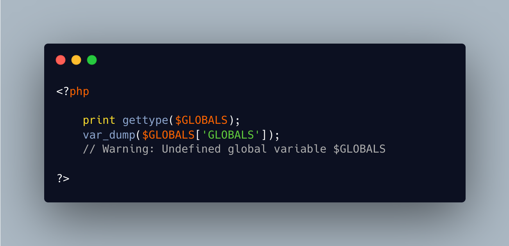

.. _$globals-is-not-defined:

$GLOBALS Is Not Defined
-----------------------

.. meta::
	:description:
		$GLOBALS Is Not Defined: $GLOBALS is a PHP superglobal, which is always available, no matter the context.
	:twitter:card: summary_large_image
	:twitter:site: @exakat
	:twitter:title: $GLOBALS Is Not Defined
	:twitter:description: $GLOBALS Is Not Defined: $GLOBALS is a PHP superglobal, which is always available, no matter the context
	:twitter:creator: @exakat
	:twitter:image:src: https://php-tips.readthedocs.io/en/latest/_images/GLOBALS_is_not_defined.png
	:og:image: https://php-tips.readthedocs.io/en/latest/_images/GLOBALS_is_not_defined.png
	:og:title: $GLOBALS Is Not Defined
	:og:type: article
	:og:description: $GLOBALS is a PHP superglobal, which is always available, no matter the context
	:og:url: https://php-tips.readthedocs.io/en/latest/tips/GLOBALS_is_not_defined.html
	:og:locale: en

.. raw:: html

	

$GLOBALS is a PHP superglobal, which is always available, no matter the context. It is also not possible to write it, not to unset it.

Yet, it is possible to get that cryptic error message that it is not available.

This happens when trying to reach the context ``$GLOBALS`` via the variable that holds all globals: ``$GLOBALS``. That particular entry is unreachable, as it may lead to circular references. Yet, the error message is the same as for any other global.

See Also
________

* `$GLOBALS (PHP manual) <https://www.php.net/manual/en/reserved.variables.globals.php>`_
* `No $GLOBALS here <https://3v4l.org/dLrij>`_ [Try me]

PHP Error Messages
__________________

* `Undefined global variable %s <https://php-errors.readthedocs.io/en/latest/messages/undefined-global-variable-%25s.html>`_

PHP Features
____________

* `superglobal <https://php-dictionary.readthedocs.io/en/latest/dictionary/superglobal.ini.html>`_

* `global <https://php-dictionary.readthedocs.io/en/latest/dictionary/global.ini.html>`_

* `$GLOBALS <https://php-dictionary.readthedocs.io/en/latest/dictionary/%24GLOBALS.ini.html>`_

