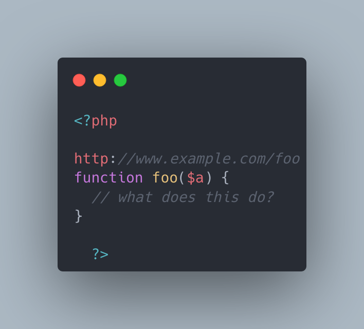

.. _url-as-comments:

URL As Comments
---------------

.. meta::
	:description:
		URL As Comments: The code below includes a raw URL in the code.
	:twitter:card: summary_large_image.
	:twitter:site: @exakat.
	:twitter:title: URL As Comments.
	:twitter:description: URL As Comments: The code below includes a raw URL in the code.
	:twitter:creator: @exakat.
	:twitter:image:src: https://php-tips.readthedocs.io/en/latest/_images/URL_as_comments.png.png.
	:og:image: https://php-tips.readthedocs.io/en/latest/_images/URL_as_comments.png.png.
	:og:image: URL As Comments: The code below includes a raw URL in the code.

The code below includes a raw URL in the code. PHP understand that code as a goto label, followed by a online comment starting with //. As such, the comment is valid, but cannot be repeated, as it would make a dual goto label, and PHP would raise an error.

* `Goto <https://www.php.net/manual/en/control-structures.goto.php>`_
* `A URL is valid PHP code?! <https://liamhammett.com/a-url-is-valid-php-code>`_

