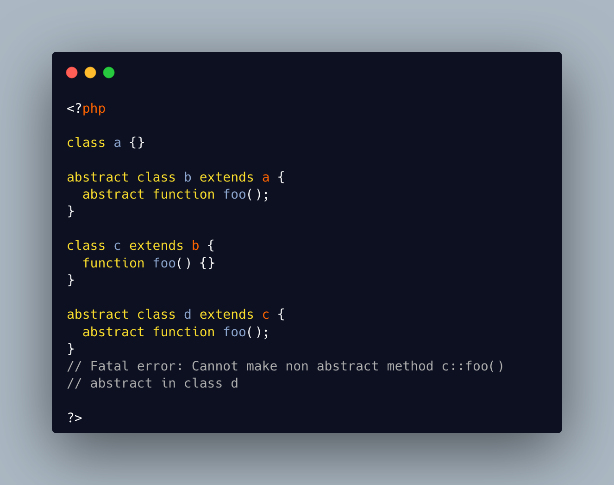

.. _abstract-again:

Abstract Again
--------------

.. meta::
	:description:
		Abstract Again: A concrete class may have an abstract child: the child class extends the parent class, and also receives the abstract option.
	:twitter:card: summary_large_image
	:twitter:site: @exakat
	:twitter:title: Abstract Again
	:twitter:description: Abstract Again: A concrete class may have an abstract child: the child class extends the parent class, and also receives the abstract option
	:twitter:creator: @exakat
	:twitter:image:src: https://php-tips.readthedocs.io/en/latest/_images/abstract_again.png
	:og:image: https://php-tips.readthedocs.io/en/latest/_images/abstract_again.png
	:og:title: Abstract Again
	:og:type: article
	:og:description: A concrete class may have an abstract child: the child class extends the parent class, and also receives the abstract option
	:og:url: https://php-tips.readthedocs.io/en/latest/tips/abstract_again.html
	:og:locale: en

.. raw:: html

	

A concrete class may have an abstract child: the child class extends the parent class, and also receives the abstract option.

On the other hand, a concrete method, inside any kind of class, cannot be made abstract in a child. The child class can be made abstract, and new methods can be made abstract. But the existing methods cannot be turned back to abstract.

See Also
________

* `Class Abstraction (PHP manual) <https://www.php.net/manual/en/language.oop5.abstract.php>`_

