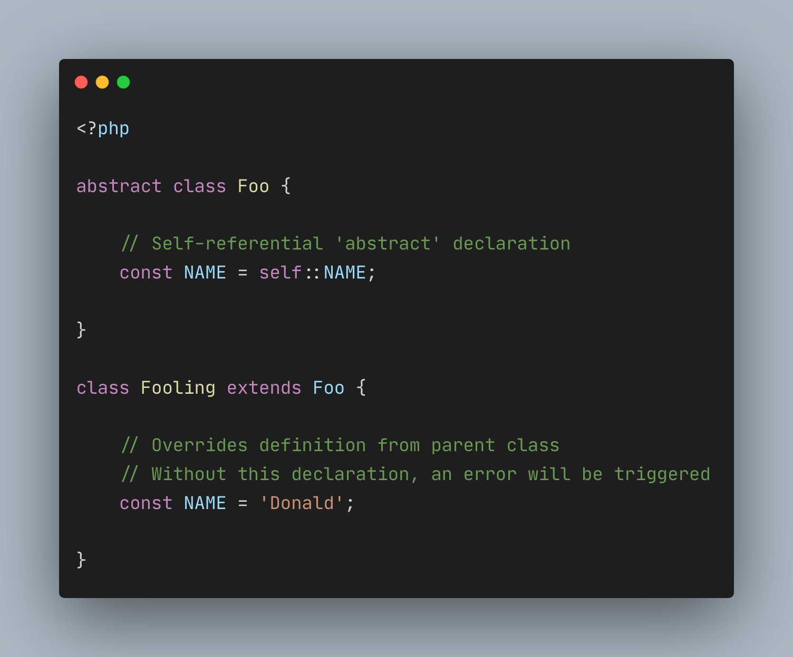

.. _abstract-constants:

Abstract Constants
------------------

.. meta::
	:description:
		Abstract Constants: There's a pretty common pattern to declare "abstract class constants" in PHP.
	:twitter:card: summary_large_image
	:twitter:site: @exakat
	:twitter:title: Abstract Constants
	:twitter:description: Abstract Constants: There's a pretty common pattern to declare "abstract class constants" in PHP
	:twitter:creator: @exakat
	:twitter:image:src: https://php-tips.readthedocs.io/en/latest/_images/abstract_constant.png
	:og:image: https://php-tips.readthedocs.io/en/latest/_images/abstract_constant.png
	:og:title: Abstract Constants
	:og:type: article
	:og:description: There's a pretty common pattern to declare "abstract class constants" in PHP
	:og:url: https://php-tips.readthedocs.io/en/latest/tips/abstract_constant.html
	:og:locale: en

By `WebSmithery <https://stackoverflow.com/users/2519523/websmithery>`_

There's a pretty common pattern to declare "abstract class constants" in PHP.

PHP lazy loading will prevent the error "Fatal error: Uncaught Error: Cannot declare self-referencing constant self::NAME" if the constant is overloaded. 

This makes an effective 'abstract constant', that must be defined to be usable.

* `Class Constants (PHP manual) <https://www.php.net/manual/en/language.oop5.constants.php>`_
* `Class Abstraction (PHP manual) <https://www.php.net/manual/en/language.oop5.abstract.php>`_
* `Abstract constants in PHP - Force a child class to define a constant <https://stackoverflow.com/questions/10368620/abstract-constants-in-php-force-a-child-class-to-define-a-constant>`_

