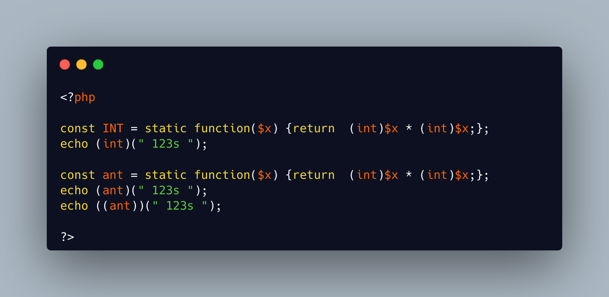

.. _abstract-or-not:

Abstract Or Not
---------------

.. meta::
	:description:
		Abstract Or Not: A parent method must have a compatible signature with the same method in any child.
	:twitter:card: summary_large_image
	:twitter:site: @exakat
	:twitter:title: Abstract Or Not
	:twitter:description: Abstract Or Not: A parent method must have a compatible signature with the same method in any child
	:twitter:creator: @exakat
	:twitter:image:src: https://php-tips.readthedocs.io/en/latest/_images/abstract_or_not.png
	:og:image: https://php-tips.readthedocs.io/en/latest/_images/abstract_or_not.png
	:og:title: Abstract Or Not
	:og:type: article
	:og:description: A parent method must have a compatible signature with the same method in any child
	:og:url: https://php-tips.readthedocs.io/en/latest/tips/abstract_or_not.html
	:og:locale: en

.. raw:: html

	

A parent method must have a compatible signature with the same method in any child.

The only exception are constructor, ``__construct``, which are not required to keep the signature compatible between parent and child.

This exception to the rule may be explicitely enforced by making the constructor ``abstract``, or by setting the constructor in an interface: in fact, methods in an interface are considered ``abstract`` by default.

See Also
________

* `constructor compatibility <https://3v4l.org/CMnhH>`_ [Try me]

PHP Error Messages
__________________

* `Declaration of b::__construct() must be compatible with a::__construct($a) <https://php-errors.readthedocs.io/en/latest/messages/declaration-of-%25s%3A%3A%25s%28%29-must-be-compatible-with-%25s%3A%3A%25s%28%29.html>`_

PHP Features
____________

* `constructor <https://php-dictionary.readthedocs.io/en/latest/dictionary/constructor.ini.html>`_

* `abstract <https://php-dictionary.readthedocs.io/en/latest/dictionary/abstract.ini.html>`_

* `method-compatibility <https://php-dictionary.readthedocs.io/en/latest/dictionary/method-compatibility.ini.html>`_

