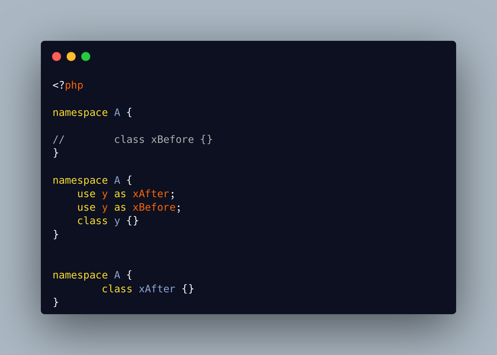

.. _alias-conflicts:

Alias Conflicts
---------------

.. meta::
	:description:
		Alias Conflicts: When the class is defined before the alias, the alias fails as the class already uses the name.
	:twitter:card: summary_large_image
	:twitter:site: @exakat
	:twitter:title: Alias Conflicts
	:twitter:description: Alias Conflicts: When the class is defined before the alias, the alias fails as the class already uses the name
	:twitter:creator: @exakat
	:twitter:image:src: https://php-tips.readthedocs.io/en/latest/_images/aliasConflicts.png
	:og:image: https://php-tips.readthedocs.io/en/latest/_images/aliasConflicts.png
	:og:title: Alias Conflicts
	:og:type: article
	:og:description: When the class is defined before the alias, the alias fails as the class already uses the name
	:og:url: https://php-tips.readthedocs.io/en/latest/tips/aliasConflicts.html
	:og:locale: en

.. raw:: html

	

When the class is defined before the alias, the alias fails as the class already uses the name. When the class is defined after the alias, the class fails, although only if the class is in the same physical namespace block as the use.

This illustration is good to show and tell, but in real life, it never happens. On the contrary, the classes and uses are in different files, and the order of loading is controller by code execution, via autoloading.

This means that reusing a namespace's class name as an alias is prone to random failures, depending on the inclusions.

As a side note, the use command does not need the definition of the orginal, until actual usage.

See Also
________

* `Possible name conflicts <https://3v4l.org/A6YOX>`_ [Try me]

