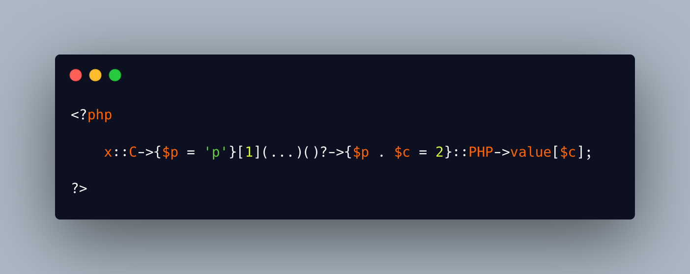

.. _all-php-dereferencements:

All PHP Dereferencements
------------------------

.. meta::
	:description:
		All PHP Dereferencements: This ugly expression holds a long list of operators to move from one value to the other and produces the simple letter 'c'.
	:twitter:card: summary_large_image
	:twitter:site: @exakat
	:twitter:title: All PHP Dereferencements
	:twitter:description: All PHP Dereferencements: This ugly expression holds a long list of operators to move from one value to the other and produces the simple letter 'c'
	:twitter:creator: @exakat
	:twitter:image:src: https://php-tips.readthedocs.io/en/latest/_images/allDereferencements.png
	:og:image: https://php-tips.readthedocs.io/en/latest/_images/allDereferencements.png
	:og:title: All PHP Dereferencements
	:og:type: article
	:og:description: This ugly expression holds a long list of operators to move from one value to the other and produces the simple letter 'c'
	:og:url: https://php-tips.readthedocs.io/en/latest/tips/allDereferencements.html
	:og:locale: en

.. raw:: html

	

This ugly expression holds a long list of operators to move from one value to the other and produces the simple letter 'c'. Can you recognize them all?

First ``::`` is a static constant, with its class on the left, and constant on the right.

The first ``->`` works on a class constant, once the constant is an object. This takes a slight detour by a global constant, and it works. It allows to call a property. This property is reached with a dynamic property name: this introduces the curly braces notation. That dynamic property name is actually a single string, but it is also stored into a local variable: because, why not? 

The next operator is the array syntax ``[1]``, which accesses the element numbered ``1`` in the previous array. 

Then, this element turns out to be a callback. The callback may be called directly, with the parenthesis ``()``, but it may also be called indirectly with the callable notation ``(...)``: this produces a closure, based on the previous callable. In this expression, it actually has no effect.

The result of the callable may, or may not, be an object. This is handled by ``?->``. If it is not, then the whole expression is actually ``null``. If it is an object, then the evaluation continues with yet another property.

There, there is a second dynamic property, build on top of the first ``$p`` and another variable, which is also assigned while being concatenated. This is the ``p2`` property. 

Since the ``p2`` property exists on the object of class ``D``, the expression uses the static ``::`` operator again. This time, it is not a constant, but a ``case`` from an enumeration. There is no way to distinguish cases and constant at call time. 

The enumeration ``F`` is backed by a string, so this automatically introduces properties to the enumeration objects, ``name`` and ``value``. Here, the second ``->`` operator reaches to this implicityly declared property. 

Finally, ``value`` produces a string, and strings accept the array syntax. ``[$c]`` is actually ``[2]``, as ``$c`` was assigned the value ``2``, and this was done at bit earlier in the expression. 

At the end, there is one of the most convulted literal ``c`` character.

See Also
________

* `Can you understand this? <https://3v4l.org/0bOpD>`_ [Try me]

PHP Features
____________

* `enum <https://php-dictionary.readthedocs.io/en/latest/dictionary/enum.ini.html>`_

* `class <https://php-dictionary.readthedocs.io/en/latest/dictionary/class.ini.html>`_

* `backedenum <https://php-dictionary.readthedocs.io/en/latest/dictionary/backedenum.ini.html>`_

