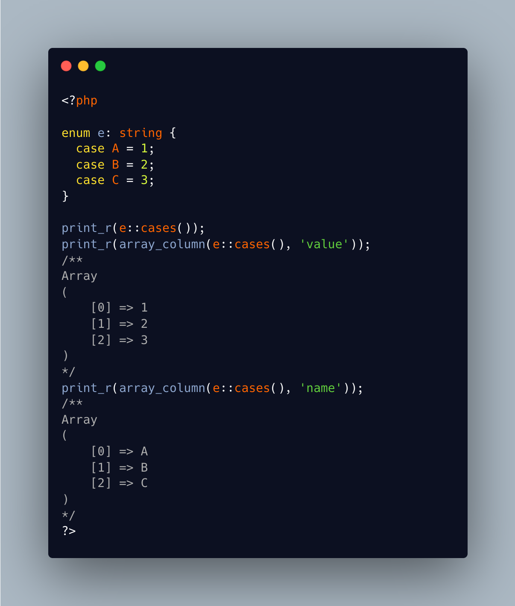

.. _all-enum-cases:

All Enum Cases
--------------

.. meta::
	:description:
		All Enum Cases: One convenient aspect of enumerations is that they come with a full list of their cases.
	:twitter:card: summary_large_image
	:twitter:site: @exakat
	:twitter:title: All Enum Cases
	:twitter:description: All Enum Cases: One convenient aspect of enumerations is that they come with a full list of their cases
	:twitter:creator: @exakat
	:twitter:image:src: https://php-tips.readthedocs.io/en/latest/_images/all_cases.png
	:og:image: https://php-tips.readthedocs.io/en/latest/_images/all_cases.png
	:og:title: All Enum Cases
	:og:type: article
	:og:description: One convenient aspect of enumerations is that they come with a full list of their cases
	:og:url: https://php-tips.readthedocs.io/en/latest/tips/all_cases.html
	:og:locale: en

.. raw:: html

	

One convenient aspect of enumerations is that they come with a full list of their cases. Call the ``::cases()`` on any enumeration to get the full list of elements.

Then, convert this list into their scalar representation, if any, by calling ``array_column``, with the public property ``value``.

And it always works with the ``name`` property, to collect the names of the cases.

See Also
________

* `Enumerations (PHP manual) <https://www.php.net/manual/en/language.enumerations.php>`_
* `Value Listing (PHP manual) <https://www.php.net/manual/en/language.enumerations.listing.php>`_
* `Backed Enumerations (PHP manual) <https://www.php.net/manual/en/language.enumerations.backed.php>`_
* `All the enum cases <https://3v4l.org/JATi0>`_ [Try me]

PHP Features
____________

* `enum <https://php-dictionary.readthedocs.io/en/latest/dictionary/enum.ini.html>`_

* `enum-case <https://php-dictionary.readthedocs.io/en/latest/dictionary/enum-case.ini.html>`_

