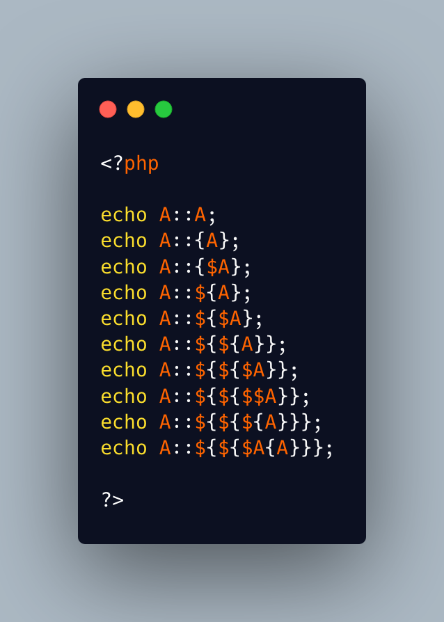

.. _all-static-curly-syntaxes-and-one-wrong:

All Static Curly Syntaxes And One Wrong
---------------------------------------

.. meta::
	:description:
		All Static Curly Syntaxes And One Wrong: What is the only invalid syntax in the following list.
	:twitter:card: summary_large_image
	:twitter:site: @exakat
	:twitter:title: All Static Curly Syntaxes And One Wrong
	:twitter:description: All Static Curly Syntaxes And One Wrong: What is the only invalid syntax in the following list
	:twitter:creator: @exakat
	:twitter:image:src: https://php-tips.readthedocs.io/en/latest/_images/all_static_curly_syntaxes.png
	:og:image: https://php-tips.readthedocs.io/en/latest/_images/all_static_curly_syntaxes.png
	:og:title: All Static Curly Syntaxes And One Wrong
	:og:type: article
	:og:description: What is the only invalid syntax in the following list
	:og:url: https://php-tips.readthedocs.io/en/latest/tips/all_static_curly_syntaxes.html
	:og:locale: en

.. raw:: html

	

What is the only invalid syntax in the following list?

Assume that all needed definitions are available.

Let's review them all.

1) This is a classic class constant syntax, or an enumeration case. 

2) This is the new PHP 8.3 variable class constant syntax. The trick is that the dynamic part is the global constant A. 

3) This is the new PHP 8.3 variable class constant syntax. The name of the constant is in the variable $A.

4) This is the variable static property class. The name of the property is in the global constant A.

5) This is the variable static property class. The name of the property is in the variable $A.

6) This is the variable static property class. The name of the property is in the global constant A, which builds the variable variable ${A}.

7) This is the variable static property class. The name of the property is in the variable $A, which builds the variable variable ${$A}.

8) This is the variable static property class. The name of the property is in the variable variable $$A, which builds the variable variable ${$$A}.

9) This is the variable static property class. The name of the property is in the variable variable ${$A}. It is a composition of previous cases.

10) This is the problematic one. $A{A} is an attempt at reading a element at position A in the variable $A. This is a removed PHP feature, since PHP 8. It should be written $A[A], though it would be too obvious for the puzzle.

