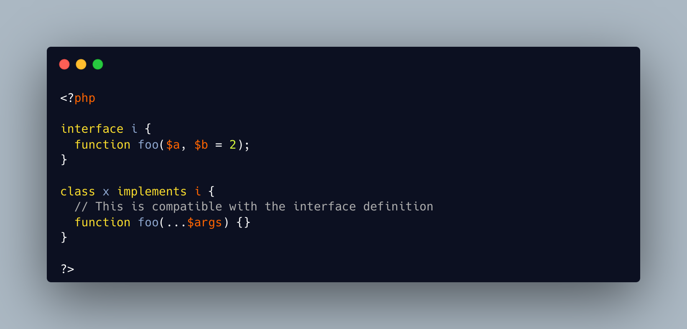

.. _always-compatible-variadic:

Always Compatible Variadic
--------------------------

.. meta::
	:description:
		Always Compatible Variadic: A variadic argument is a valid and compatible signature, for methods that overwrite other methods.
	:twitter:card: summary_large_image
	:twitter:site: @exakat
	:twitter:title: Always Compatible Variadic
	:twitter:description: Always Compatible Variadic: A variadic argument is a valid and compatible signature, for methods that overwrite other methods
	:twitter:creator: @exakat
	:twitter:image:src: https://php-tips.readthedocs.io/en/latest/_images/always_compatible_variadic.png
	:og:image: https://php-tips.readthedocs.io/en/latest/_images/always_compatible_variadic.png
	:og:title: Always Compatible Variadic
	:og:type: article
	:og:description: A variadic argument is a valid and compatible signature, for methods that overwrite other methods
	:og:url: https://php-tips.readthedocs.io/en/latest/tips/always_compatible_variadic.html
	:og:locale: en

.. raw:: html

	

By `Sergii Shymko <https://twitter.com/SergiiShymko>`_

A variadic argument is a valid and compatible signature, for methods that overwrite other methods.

Method compatibility usually require the arguments to be the same, but with a variadic argument and also some of the arguments from the parent method, the signature is still considered compatible by PHP.

See Also
________

* `Variable-length argument lists (PHP manual) <https://www.php.net/manual/en/functions.arguments.php#functions.variable-arg-list>`_
* `Original Tweet <https://twitter.com/SergiiShymko/status/1744905838089961807>`_

