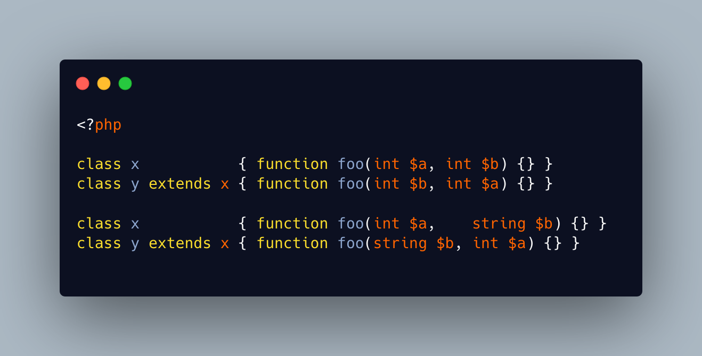

.. _argument-renaming:

Argument Renaming
-----------------

.. meta::
	:description:
		Argument Renaming: Method compatibility does not allow adding or removing arguments between a parent and a child, and types must be compatible.
	:twitter:card: summary_large_image
	:twitter:site: @exakat
	:twitter:title: Argument Renaming
	:twitter:description: Argument Renaming: Method compatibility does not allow adding or removing arguments between a parent and a child, and types must be compatible
	:twitter:creator: @exakat
	:twitter:image:src: https://php-tips.readthedocs.io/en/latest/_images/arg_renaming.png
	:og:image: https://php-tips.readthedocs.io/en/latest/_images/arg_renaming.png
	:og:title: Argument Renaming
	:og:type: article
	:og:description: Method compatibility does not allow adding or removing arguments between a parent and a child, and types must be compatible
	:og:url: https://php-tips.readthedocs.io/en/latest/tips/arg_renaming.html
	:og:locale: en

.. raw:: html

	

Method compatibility does not allow adding or removing arguments between a parent and a child, and types must be compatible.

Yet, it is possible to rename arguments. When the argument types are distinct, method compatibility emits an error, but when both types are identical, this typo may go undetected.

See Also
________

* `Argument switcheroo <https://3v4l.org/qKEbO>`_ [Try me]

PHP Error Messages
__________________

* `Declaration of y4::foo($b, $c, $d) must be compatible with x4::foo($a, $b) <https://php-errors.readthedocs.io/en/latest/messages/declaration-of-%25s%3A%3A%25s%28%29-must-be-compatible-with-%25s%3A%3A%25s%28%29.html>`_

PHP Features
____________

* `argument <https://php-dictionary.readthedocs.io/en/latest/dictionary/argument.ini.html>`_

* `method-compatibility <https://php-dictionary.readthedocs.io/en/latest/dictionary/method-compatibility.ini.html>`_

