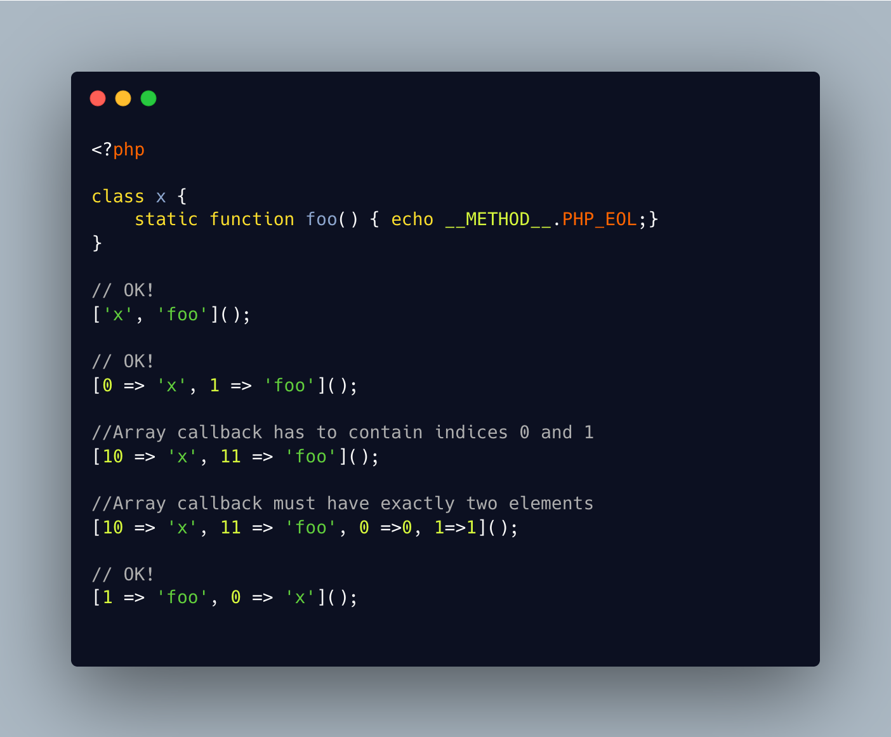

.. _array-callaback-index:

Array Callaback Index
---------------------

.. meta::
	:description:
		Array Callaback Index: An array callback must be built with two elements, and their index must be ``0``, for the class or object, and ``1`` for the method name.
	:twitter:card: summary_large_image
	:twitter:site: @exakat
	:twitter:title: Array Callaback Index
	:twitter:description: Array Callaback Index: An array callback must be built with two elements, and their index must be ``0``, for the class or object, and ``1`` for the method name
	:twitter:creator: @exakat
	:twitter:image:src: https://php-tips.readthedocs.io/en/latest/_images/array-callaback-index.png
	:og:image: https://php-tips.readthedocs.io/en/latest/_images/array-callaback-index.png
	:og:title: Array Callaback Index
	:og:type: article
	:og:description: An array callback must be built with two elements, and their index must be ``0``, for the class or object, and ``1`` for the method name
	:og:url: https://php-tips.readthedocs.io/en/latest/tips/array-callaback-index.html
	:og:locale: en

.. raw:: html

	

An array callback must be built with two elements, and their index must be ``0``, for the class or object, and ``1`` for the method name. PHP enforces the number of elements in the array, and the actual used index.

On the other hand, one may build the array in the wrong order but the correct index, and get the expected result. Nice!

See Also
________

* `Callbacks / Callables (PHP manual) <https://www.php.net/manual/en/language.types.callable.php>`_
* `Which array is callable?  <https://3v4l.org/49TcN>`_ [Try me]

PHP Error Messages
__________________

* `Array callback has to contain indices 0 and 1 <https://php-errors.readthedocs.io/en/latest/messages/array-callback-has-to-contain-indices-0-and-1.html>`_

* `Array callback must have exactly two elements <https://php-errors.readthedocs.io/en/latest/messages/array-callback-must-have-exactly-two-elements.html>`_

PHP Features
____________

* `array <https://php-dictionary.readthedocs.io/en/latest/dictionary/array.ini.html>`_

* `array-callable <https://php-dictionary.readthedocs.io/en/latest/dictionary/array-callable.ini.html>`_

