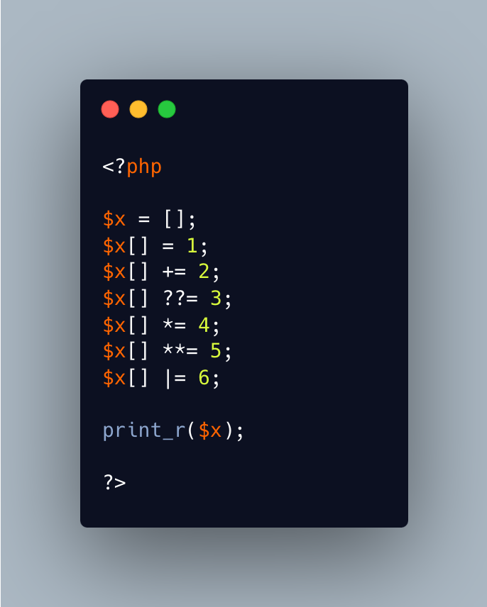

.. _array_append()-and-short-assignation:

array_append() And Short Assignation
------------------------------------

.. meta::
	:description:
		array_append() And Short Assignation: PHP allows using short assignation operators with the array append operators.
	:twitter:card: summary_large_image
	:twitter:site: @exakat
	:twitter:title: array_append() And Short Assignation
	:twitter:description: array_append() And Short Assignation: PHP allows using short assignation operators with the array append operators
	:twitter:creator: @exakat
	:twitter:image:src: https://php-tips.readthedocs.io/en/latest/_images/array_append.png
	:og:image: https://php-tips.readthedocs.io/en/latest/_images/array_append.png
	:og:title: array_append() And Short Assignation
	:og:type: article
	:og:description: PHP allows using short assignation operators with the array append operators
	:og:url: https://php-tips.readthedocs.io/en/latest/tips/array_append.html
	:og:locale: en

.. raw:: html

	

PHP allows using short assignation operators with the array append operators. This means that the code adds ``2`` to the array append. No error is displayed, except in the case of ``??=``, who is yield a Fatal error, with an explicit "Cannot use [] for reading".

In any case, all of those expressions make little sense : the short assignation operators shall exist on an existing value, not a new one. Here, it looks like the default value is null.

See Also
________

* `Array (PHP manual) <https://www.php.net/manual/en/language.types.array.php#language.types.array>`_
* `Run this code <https://3v4l.org/0WDiL>`_ [Try me]

PHP Error Messages
__________________

* `Cannot use [] for reading <https://php-errors.readthedocs.io/en/latest/messages/cannot-use-%5B%5D-for-reading.html>`_

PHP Features
____________

* `operator <https://php-dictionary.readthedocs.io/en/latest/dictionary/operator.ini.html>`_

* `array <https://php-dictionary.readthedocs.io/en/latest/dictionary/array.ini.html>`_

* `append <https://php-dictionary.readthedocs.io/en/latest/dictionary/append.ini.html>`_

* `error <https://php-dictionary.readthedocs.io/en/latest/dictionary/error.ini.html>`_

* `case <https://php-dictionary.readthedocs.io/en/latest/dictionary/case.ini.html>`_

* `yield <https://php-dictionary.readthedocs.io/en/latest/dictionary/yield.ini.html>`_

* `explicit <https://php-dictionary.readthedocs.io/en/latest/dictionary/explicit.ini.html>`_

* `reading <https://php-dictionary.readthedocs.io/en/latest/dictionary/reading.ini.html>`_

* `expression <https://php-dictionary.readthedocs.io/en/latest/dictionary/expression.ini.html>`_

* `value <https://php-dictionary.readthedocs.io/en/latest/dictionary/value.ini.html>`_

* `not <https://php-dictionary.readthedocs.io/en/latest/dictionary/not.ini.html>`_

* `new <https://php-dictionary.readthedocs.io/en/latest/dictionary/new.ini.html>`_

* `default-value <https://php-dictionary.readthedocs.io/en/latest/dictionary/default-value.ini.html>`_

* `null <https://php-dictionary.readthedocs.io/en/latest/dictionary/null.ini.html>`_

* `append <https://php-dictionary.readthedocs.io/en/latest/dictionary/append.ini.html>`_

* `short-assignation <https://php-dictionary.readthedocs.io/en/latest/dictionary/short-assignation.ini.html>`_

