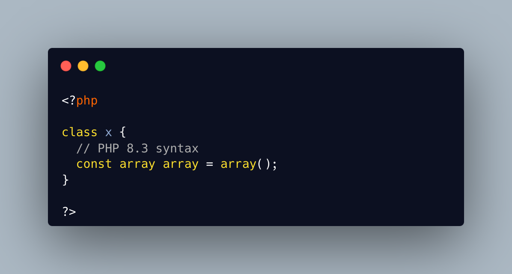

.. _array-array-=-array():

array array = array()
---------------------

This made me chuckle... welcome to PHP 8.3 !

First array is the type, the second is the name of the constant, with the relaxed keyword, and the last one is the value of the array.

