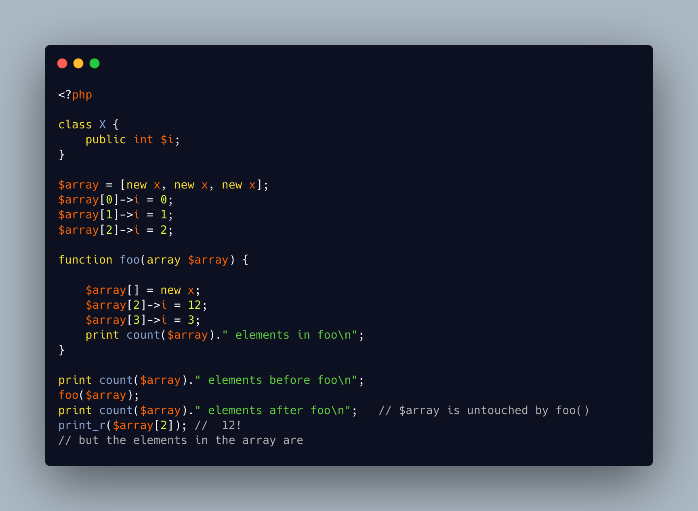

.. _array-items-by-value:

Array Items By Value
--------------------

.. meta::
	:description:
		Array Items By Value: In this code, an array is built with objects.
	:twitter:card: summary_large_image
	:twitter:site: @exakat
	:twitter:title: Array Items By Value
	:twitter:description: Array Items By Value: In this code, an array is built with objects
	:twitter:creator: @exakat
	:twitter:image:src: https://php-tips.readthedocs.io/en/latest/_images/array_by_value.png
	:og:image: https://php-tips.readthedocs.io/en/latest/_images/array_by_value.png
	:og:title: Array Items By Value
	:og:type: article
	:og:description: In this code, an array is built with objects
	:og:url: https://php-tips.readthedocs.io/en/latest/tips/array_by_value.html
	:og:locale: en

.. raw:: html

	

In this code, an array is built with objects. The array is passed by value to the function. The function updates both the array and one of the elements. When the function is finished, the array in the calling context is still the same, but the object #2 has changed.

In this case, PHP applies copy on write, or COW: the array is passed by value, and duplicated only when it is updated. But the copy applies to the objects, which are always passed by reference!

Here, the elements in the array are references, and their update is applied to the original object, in the calling context.

This is a similar situation than with ``readonly`` properties, and ``array_fill()``: the reference to the object is unchanged, but the object itself may be updated.

In general, objects may be considered as global values.

See Also
________

* `Passing array of object by value <https://3v4l.org/neuVu>`_ [Try me]

PHP Features
____________

* `reference <https://php-dictionary.readthedocs.io/en/latest/dictionary/reference.ini.html>`_

* `copy-on-write <https://php-dictionary.readthedocs.io/en/latest/dictionary/copy-on-write.ini.html>`_

* `readonly <https://php-dictionary.readthedocs.io/en/latest/dictionary/readonly.ini.html>`_

* `array_fill <https://php-dictionary.readthedocs.io/en/latest/dictionary/array_fill.ini.html>`_

