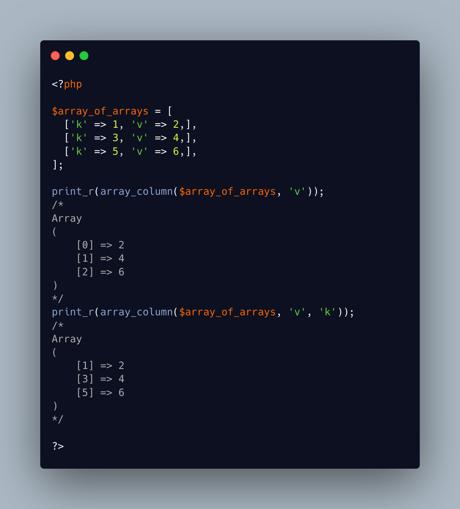

.. _array_column()-to-hash:

array_column() To Hash
----------------------

.. meta::
	:description:
		array_column() To Hash: array_column() is a very handy PHP native function, which extracts a index from a list of arrays, or a public property from a list of objects.
	:twitter:card: summary_large_image
	:twitter:site: @exakat
	:twitter:title: array_column() To Hash
	:twitter:description: array_column() To Hash: array_column() is a very handy PHP native function, which extracts a index from a list of arrays, or a public property from a list of objects
	:twitter:creator: @exakat
	:twitter:image:src: https://php-tips.readthedocs.io/en/latest/_images/array_column_to_hash.png
	:og:image: https://php-tips.readthedocs.io/en/latest/_images/array_column_to_hash.png
	:og:title: array_column() To Hash
	:og:type: article
	:og:description: array_column() is a very handy PHP native function, which extracts a index from a list of arrays, or a public property from a list of objects
	:og:url: https://php-tips.readthedocs.io/en/latest/tips/array_column_to_hash.html
	:og:locale: en

.. raw:: html

	

array_column() is a very handy PHP native function, which extracts a index from a list of arrays, or a public property from a list of objects.

The third argument of array_column() is a key, which will be used to reference the value in the resulting array. It is very convenient to turn an array into a hash.

Note that duplicate keys will be overwritten. 

Also, there is no reciproque function for this: turn a hash into an array of arrays or objects.

See Also
________

* `array_column (PHP manual) <https://www.php.net/manual/en/function.array-column.php>`_
* `Magic constants <https://3v4l.org/JuFfn>`_

