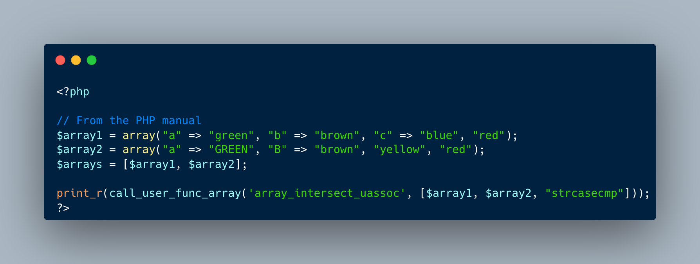

.. _how-to-array_intersect_uassoc_insensitive():

How To array_intersect_uassoc_insensitive()
-------------------------------------------

.. meta::
	:description:
		How To array_intersect_uassoc_insensitive(): array_intersect() functions use a direct comparison between the values in the array to make the comparison.
	:twitter:card: summary_large_image
	:twitter:site: @exakat
	:twitter:title: How To array_intersect_uassoc_insensitive()
	:twitter:description: How To array_intersect_uassoc_insensitive(): array_intersect() functions use a direct comparison between the values in the array to make the comparison
	:twitter:creator: @exakat
	:twitter:image:src: https://php-tips.readthedocs.io/en/latest/_images/array_intersect_uassoc_insensitive.png
	:og:image: https://php-tips.readthedocs.io/en/latest/_images/array_intersect_uassoc_insensitive.png
	:og:title: How To array_intersect_uassoc_insensitive()
	:og:type: article
	:og:description: array_intersect() functions use a direct comparison between the values in the array to make the comparison
	:og:url: https://php-tips.readthedocs.io/en/latest/tips/array_intersect_uassoc_insensitive.html
	:og:locale: en

.. raw:: html

	

array_intersect() functions use a direct comparison between the values in the array to make the comparison. When the comparison needs to be case insensitive, then one can use the ``u`` version of those functions, to make a case insensitive comparison.

See Also
________

* `array_intersect() <https://www.php.net/array_intersect>`_
* `array_intersect_key() <https://www.php.net/array_intersect_key>`_
* `array_intersect_ukey() <https://www.php.net/array_intersect_ukey>`_
* `array_intersect_assoc() <https://www.php.net/array_intersect_assoc>`_
* `array_intersect_uassoc() <https://www.php.net/array_intersect_uassoc>`_
* `array_intersect_case_insensitive() <https://3v4l.org/jatEa>`_

