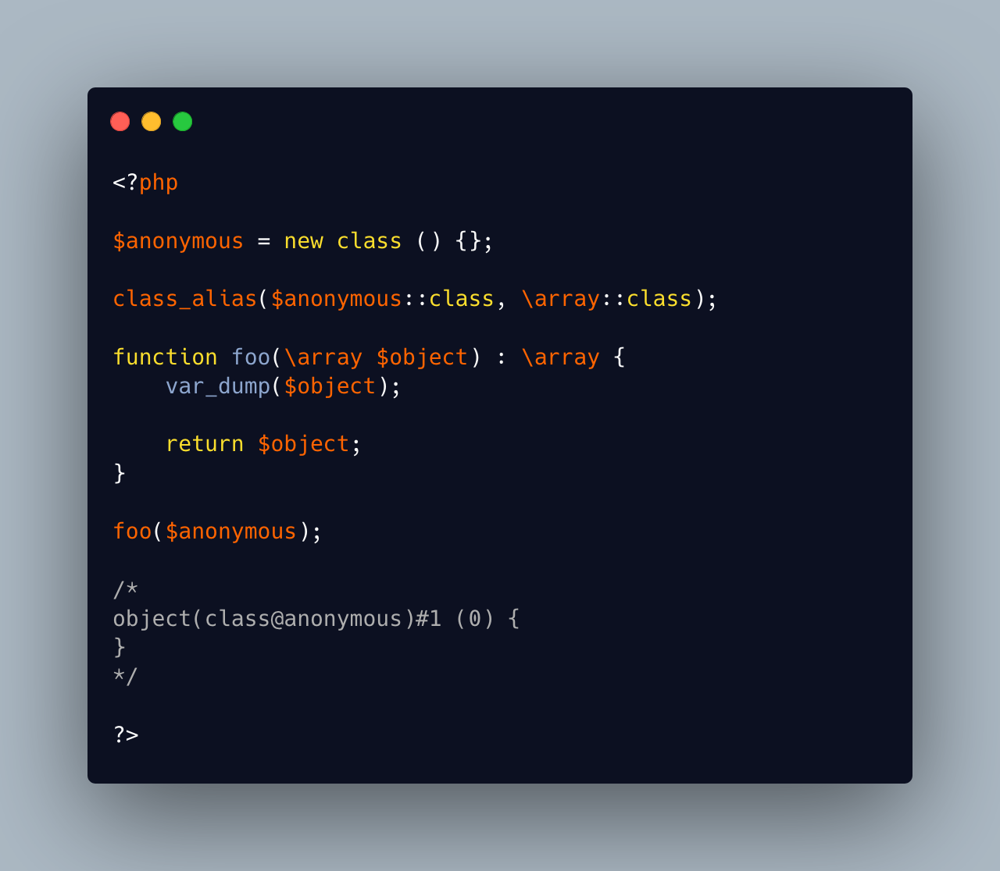

.. _\\array-was-customizable:

\\array Was Customizable
------------------------

.. meta::
	:description:
		\\array Was Customizable: This code gathers several PHP hacks together.
	:twitter:card: summary_large_image
	:twitter:site: @exakat
	:twitter:title: \\array Was Customizable
	:twitter:description: \\array Was Customizable: This code gathers several PHP hacks together
	:twitter:creator: @exakat
	:twitter:image:src: https://php-tips.readthedocs.io/en/latest/_images/array_is_custom.png
	:og:image: https://php-tips.readthedocs.io/en/latest/_images/array_is_custom.png
	:og:title: \\array Was Customizable
	:og:type: article
	:og:description: This code gathers several PHP hacks together
	:og:url: https://php-tips.readthedocs.io/en/latest/tips/array_is_custom.html
	:og:locale: en

This code gathers several PHP hacks together.

First, the naming of an anonymous class, and this time, it is renamed as ``\array``.

``array`` would not work, but the absolute naming make it pass.

Then, that ``\array`` is used as type, and it works.

Now, there is something that looks like an array, but is actually a random object.

This is a bug, since other PHP native types, like ``int`` disallow usage of their absolute name.

This was reported as a bug, and fixed in PHP 8.4. Thanks!.

* `\array should not be usable #16665 <https://github.com/php/php-src/issues/16665>`_
* `Type declaration ‘%s’ must be unqualified <https://php-errors.readthedocs.io/en/latest/messages/type-declaration-%27%25s%27-must-be-unqualified.html>`_

