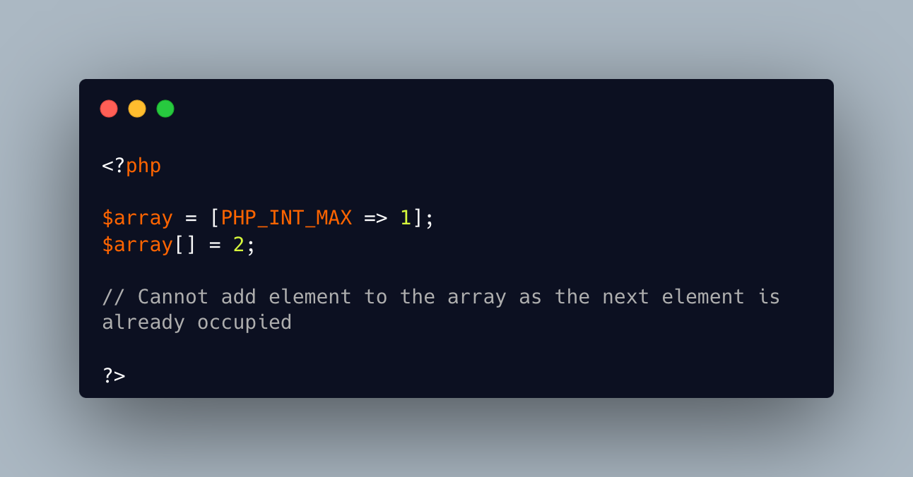

.. _array-is-full:

Array Is Full
-------------

.. meta::
	:description:
		Array Is Full: When using append, the next id is calculated based on the largest integer key ever used in that array.
	:twitter:card: summary_large_image
	:twitter:site: @exakat
	:twitter:title: Array Is Full
	:twitter:description: Array Is Full: When using append, the next id is calculated based on the largest integer key ever used in that array
	:twitter:creator: @exakat
	:twitter:image:src: https://php-tips.readthedocs.io/en/latest/_images/array_is_full.png.png
	:og:image: https://php-tips.readthedocs.io/en/latest/_images/array_is_full.png
	:og:title: Array Is Full
	:og:type: article
	:og:description: When using append, the next id is calculated based on the largest integer key ever used in that array
	:og:url: https://php-tips.readthedocs.io/en/latest/tips/array_is_full.html
	:og:locale: en

When using append, the next id is calculated based on the largest integer key ever used in that array. When the array has reached the biggest integer possible, aka PHP_INT_MAX, then the next-array-key generator fails, and this error is displayed.

Also, it is a fatal error to fill an array beyond its capacity.

* `array (PHP manual) <https://www.php.net/manual/en/language.types.array.php>`_
* `PHP_INT_MAX <https://www.php.net/manual/en/reserved.constants.php>`_

