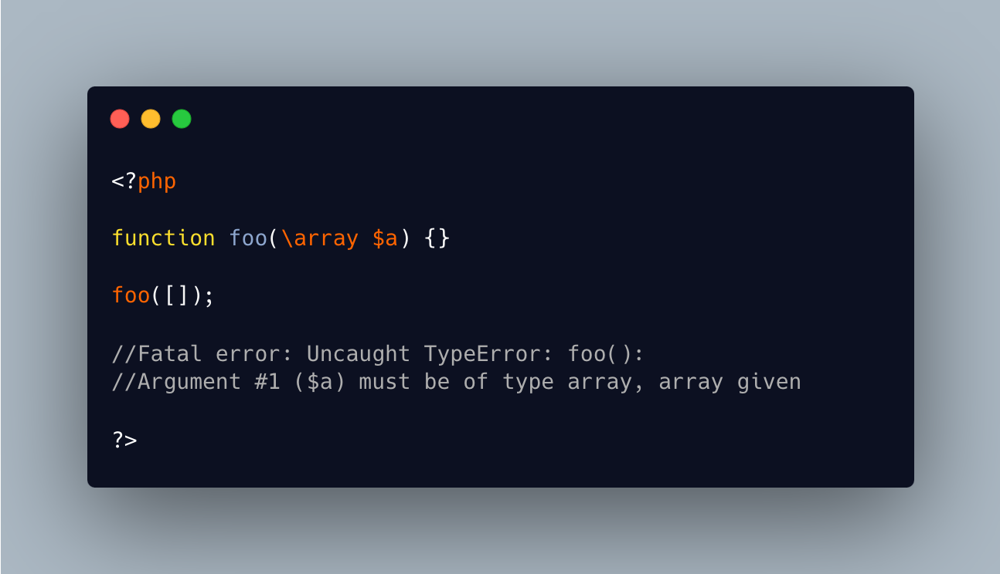

.. _array-is-not-an-array:

array Is Not An Array
---------------------

.. meta::
	:description:
		array Is Not An Array: PHP native types, such as the scalar ``int`` cannot be specified with a leading ``\``.
	:twitter:card: summary_large_image
	:twitter:site: @exakat
	:twitter:title: array Is Not An Array
	:twitter:description: array Is Not An Array: PHP native types, such as the scalar ``int`` cannot be specified with a leading ``\``
	:twitter:creator: @exakat
	:twitter:image:src: https://php-tips.readthedocs.io/en/latest/_images/array_is_not_an_array.png
	:og:image: https://php-tips.readthedocs.io/en/latest/_images/array_is_not_an_array.png
	:og:title: array Is Not An Array
	:og:type: article
	:og:description: PHP native types, such as the scalar ``int`` cannot be specified with a leading ``\``
	:og:url: https://php-tips.readthedocs.io/en/latest/tips/array_is_not_an_array.html
	:og:locale: en

.. raw:: html

	

PHP native types, such as the scalar ``int`` cannot be specified with a leading ``\``. Such code get hit with a ``Type declaration ‘\int’ must be unqualified``.

This is the case for all of the PHP native types, except for ``array``, and ``iterable``.

That error message is really hilarious.

* `Type declaration ‘%s’ must be unqualified <https://php-errors.readthedocs.io/en/latest/messages/type-declaration-%27%25s%27-must-be-unqualified.html>`_

