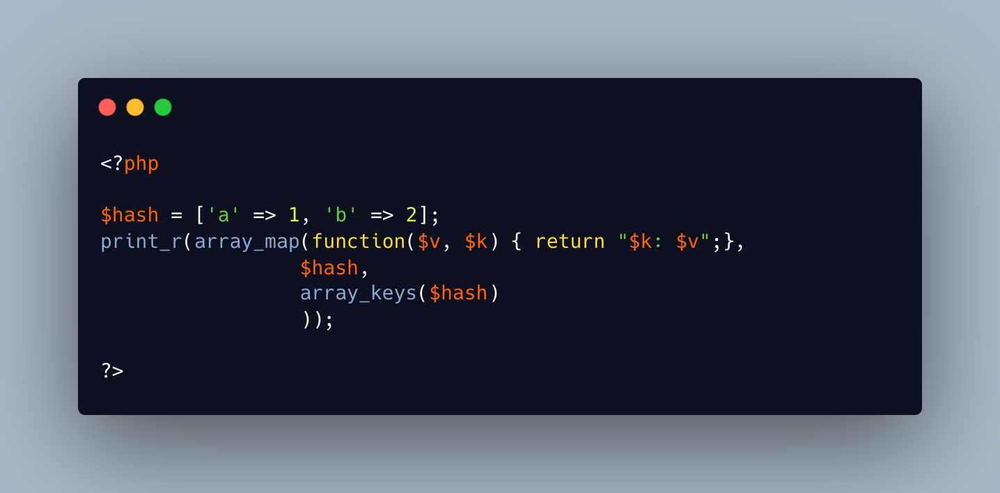

.. _array_map_assoc()-with-keys:

array_map_assoc() With Keys
---------------------------

.. meta::
	:description:
		array_map_assoc() With Keys: array_map() only provides the value of the array, not the key.
	:twitter:card: summary_large_image
	:twitter:site: @exakat
	:twitter:title: array_map_assoc() With Keys
	:twitter:description: array_map_assoc() With Keys: array_map() only provides the value of the array, not the key
	:twitter:creator: @exakat
	:twitter:image:src: https://php-tips.readthedocs.io/en/latest/_images/array_map_assoc.png
	:og:image: https://php-tips.readthedocs.io/en/latest/_images/array_map_assoc.png
	:og:title: array_map_assoc() With Keys
	:og:type: article
	:og:description: array_map() only provides the value of the array, not the key
	:og:url: https://php-tips.readthedocs.io/en/latest/tips/array_map_assoc.html
	:og:locale: en

.. raw:: html

	

array_map() only provides the value of the array, not the key. To access the key, one must use the extra argument, and array_keys().

Beware that the order of the arguments is now value first, key second, not the usual ``$key => $value``.

See Also
________

* `array_map (PHP manual) <https://www.php.net/manual/en/function.array_map.php>`_
* `array_map_assoc() with keys <https://3v4l.org/v72hT>`_ [Try me]

PHP Features
____________

* `array <https://php-dictionary.readthedocs.io/en/latest/dictionary/array.ini.html>`_

