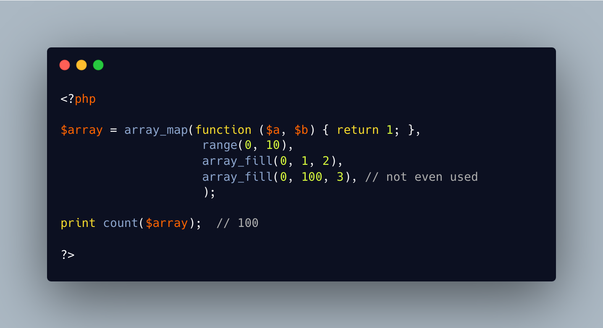

.. _array_map()-goes-full-throttle:

array_map() Goes Full Throttle
------------------------------

.. meta::
	:description:
		array_map() Goes Full Throttle: array_map() applies a closure (first arg) to every elements of an array (second arg).
	:twitter:card: summary_large_image
	:twitter:site: @exakat
	:twitter:title: array_map() Goes Full Throttle
	:twitter:description: array_map() Goes Full Throttle: array_map() applies a closure (first arg) to every elements of an array (second arg)
	:twitter:creator: @exakat
	:twitter:image:src: https://php-tips.readthedocs.io/en/latest/_images/array_map_to_the_max.png
	:og:image: https://php-tips.readthedocs.io/en/latest/_images/array_map_to_the_max.png
	:og:title: array_map() Goes Full Throttle
	:og:type: article
	:og:description: array_map() applies a closure (first arg) to every elements of an array (second arg)
	:og:url: https://php-tips.readthedocs.io/en/latest/tips/array_map_to_the_max.html
	:og:locale: en

.. raw:: html

	

array_map() applies a closure (first arg) to every elements of an array (second arg).

When the closure needs more parameters, they may be passed as third (and n-th) parameter, as an array. When there are less extra parameters than the closure needs, PHP emits a ArgumentCountError exception.

When there are too many extra parameters, PHP just omits them, silently.

A call to array_map() makes sense when all the provided arrays have the same number of elements. 

When the numbers of elements differ, PHP runs the function for the largest array possible. It provides ``null``, anytime an element is missing. This is also the case when the array is superfluous: here, the last array has 100 elements, and is not used in the closure, but forces the results to have 100 entries.

* `array_map (PHP manual) <https://www.php.net/manual/en/function.array_map.php>`_

