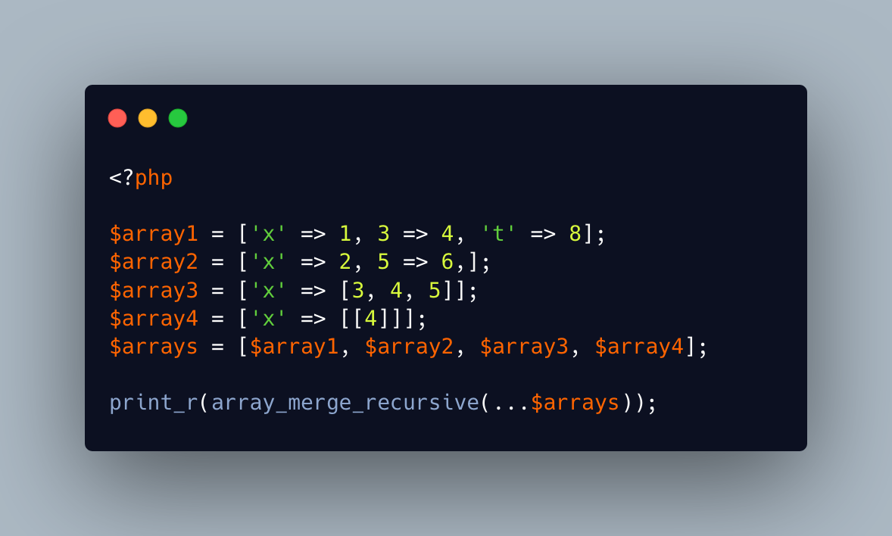

.. _the-recursive-array_merge():

The Recursive array_merge()
---------------------------

.. meta::
	:description:
		The Recursive array_merge(): array_merge_recursive() merges several arrays together, like its cousin array_merge().
	:twitter:card: summary_large_image
	:twitter:site: @exakat
	:twitter:title: The Recursive array_merge()
	:twitter:description: The Recursive array_merge(): array_merge_recursive() merges several arrays together, like its cousin array_merge()
	:twitter:creator: @exakat
	:twitter:image:src: https://php-tips.readthedocs.io/en/latest/_images/array_merge_recursive.png
	:og:image: https://php-tips.readthedocs.io/en/latest/_images/array_merge_recursive.png
	:og:title: The Recursive array_merge()
	:og:type: article
	:og:description: array_merge_recursive() merges several arrays together, like its cousin array_merge()
	:og:url: https://php-tips.readthedocs.io/en/latest/tips/array_merge_recursive.html
	:og:locale: en

.. raw:: html

	

array_merge_recursive() merges several arrays together, like its cousin array_merge(). The important difference here is where the recursive applies.

The operation is recursive because the string keys will be merged together into an array, whenever the same key is found multiple times. A new array is created: scalar values are added to this array, and arrays are merged with it. Single keys are kept intact and integer keys are reindexed, starting at 0.

Note that to avoid the merge of sub-arrays, one need to put it inside yet another array (see array4).

See Also
________

* `array_merge_recursive() (PHP manual) <https://www.php.net/manual/en/function.array-merge-recursive.php>`_
* `array_merge_recursive() in action <https://3v4l.org/OMqOc>`_ [Try me]

