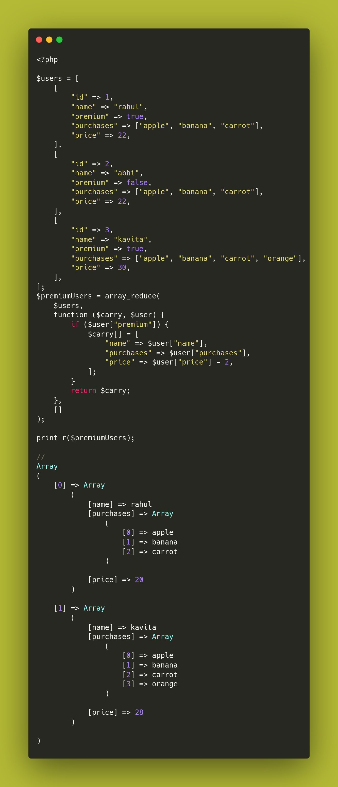

.. _array_reduce()-to-filter-and-alter:

array_reduce() To Filter And Alter
----------------------------------

.. meta::
	:description:
		array_reduce() To Filter And Alter: Using array_reduce() to create custom data structures goes beyond simple filtering.
	:twitter:card: summary_large_image
	:twitter:site: @exakat
	:twitter:title: array_reduce() To Filter And Alter
	:twitter:description: array_reduce() To Filter And Alter: Using array_reduce() to create custom data structures goes beyond simple filtering
	:twitter:creator: @exakat
	:twitter:image:src: https://php-tips.readthedocs.io/en/latest/_images/array_reduce.png
	:og:image: https://php-tips.readthedocs.io/en/latest/_images/array_reduce.png
	:og:title: array_reduce() To Filter And Alter
	:og:type: article
	:og:description: Using array_reduce() to create custom data structures goes beyond simple filtering
	:og:url: https://php-tips.readthedocs.io/en/latest/tips/array_reduce.html
	:og:locale: en

.. raw:: html

	

By `Rahul Chavan <https://twitter.com/rcsofttech85>`_

Using array_reduce() to create custom data structures goes beyond simple filtering.

array_reduce() might save a second loop. Although, it might also be quite slow, in particular for large arrays (10 millions+).

array_reduce() doesn't provide keys when processing them.

* `Original Tweet <https://twitter.com/rcsofttech85/status/1753413840245534746>`_
* `array_reduce <https://www.php.net/manual/en/function.array-reduce.php>`_
* `array_filter <https://www.php.net/manual/en/function.array-filter.php>`_
* `array_reduce is drastically slower (~1000x) <https://github.com/php/php-src/issues/8283>`_

