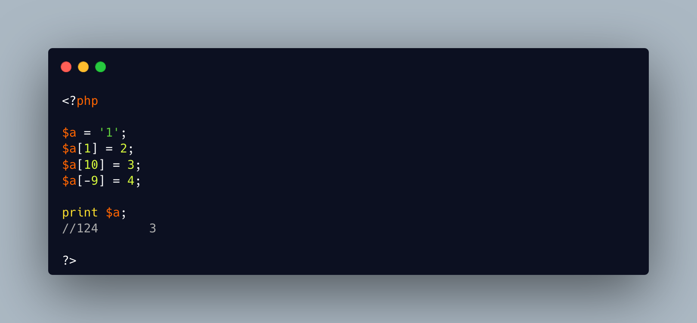

.. _modify-string-with-array-syntax:

Modify String With Array Syntax
-------------------------------

.. meta::
	:description:
		Modify String With Array Syntax: PHP strings allows access to individiual characters using the array syntax: ``$string[$index]``.
	:twitter:card: summary_large_image
	:twitter:site: @exakat
	:twitter:title: Modify String With Array Syntax
	:twitter:description: Modify String With Array Syntax: PHP strings allows access to individiual characters using the array syntax: ``$string[$index]``
	:twitter:creator: @exakat
	:twitter:image:src: https://php-tips.readthedocs.io/en/latest/_images/array_syntax_on_string.png
	:og:image: https://php-tips.readthedocs.io/en/latest/_images/array_syntax_on_string.png
	:og:title: Modify String With Array Syntax
	:og:type: article
	:og:description: PHP strings allows access to individiual characters using the array syntax: ``$string[$index]``
	:og:url: https://php-tips.readthedocs.io/en/latest/tips/array_syntax_on_string.html
	:og:locale: en

.. raw:: html

	

PHP strings allows access to individiual characters using the array syntax: ``$string[$index]``.

It is also possible to modify the string with the same syntax: the index have to be integers.

The positive integers are offsets, starting at zero. Any missing characters between the end of the string and the requested index is set to space ``' '``. Negative index are also valid, starting from the end of the string.

Here, ``$a[1]`` is just after the end of the string, ``$a[10]`` is well beyond the end of the string, and ``$a[-9]`` is almost back to the beginning of the string.

See Also
________

* `Strings (PHP manual) <https://www.php.net/manual/en/language.types.string.php>`_

