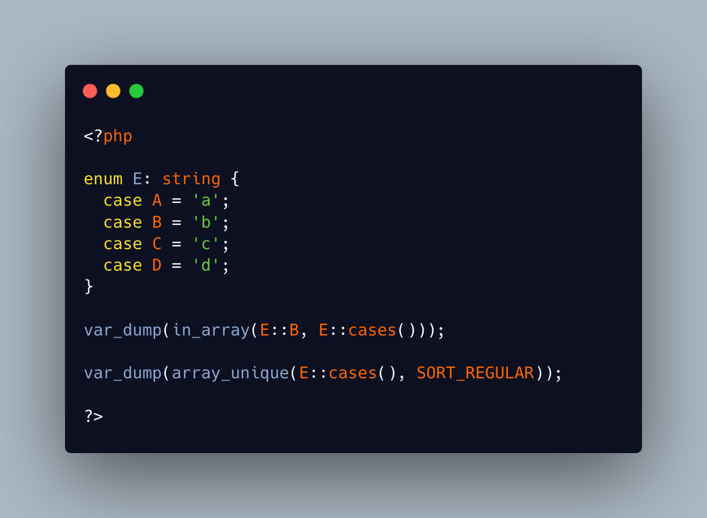

.. _array_unique()-and-enum:

array_unique() And Enum
-----------------------

.. meta::
	:description:
		array_unique() And Enum: Enumerations works like normal values, most of the time.
	:twitter:card: summary_large_image
	:twitter:site: @exakat
	:twitter:title: array_unique() And Enum
	:twitter:description: array_unique() And Enum: Enumerations works like normal values, most of the time
	:twitter:creator: @exakat
	:twitter:image:src: https://php-tips.readthedocs.io/en/latest/_images/array_unique_and_enum.png
	:og:image: https://php-tips.readthedocs.io/en/latest/_images/array_unique_and_enum.png
	:og:title: array_unique() And Enum
	:og:type: article
	:og:description: Enumerations works like normal values, most of the time
	:og:url: https://php-tips.readthedocs.io/en/latest/tips/array_unique_and_enum.html
	:og:locale: en

.. raw:: html

	

Enumerations works like normal values, most of the time. They may be used as values in arrays, but not as keys, may it be directly, or with casting.

An array of enumerations can be used with in_array(), and it works the same way, with or without the third ``strict`` parameter of the function.

On the other hand, array_unique() defaults to comparing values as strings, and enumerations can't be converted silently to strings, even when backed as strings. To make that PHP native function work, it is necessary to use the ``SORT_REGULAR`` option as third argument, which acts as ``$strict`` in in_array().

See Also
________

* `http_build_query() And Enumerations <https://php-tips.readthedocs.io/en/latest/tips/http_build_query_enum.html>`_
* `in_array, array_unique and enums <https://3v4l.org/q9iGl>`_ [Try me]

PHP Error Messages
__________________

* `Object of class E could not be converted to string <https://php-errors.readthedocs.io/en/latest/messages/object-of-class-%25s-could-not-be-converted-to-string.html>`_

PHP Features
____________

* `enum <https://php-dictionary.readthedocs.io/en/latest/dictionary/enum.ini.html>`_

* `array <https://php-dictionary.readthedocs.io/en/latest/dictionary/array.ini.html>`_

* `in_array <https://php-dictionary.readthedocs.io/en/latest/dictionary/in_array.ini.html>`_

* `array_unique <https://php-dictionary.readthedocs.io/en/latest/dictionary/array_unique.ini.html>`_

