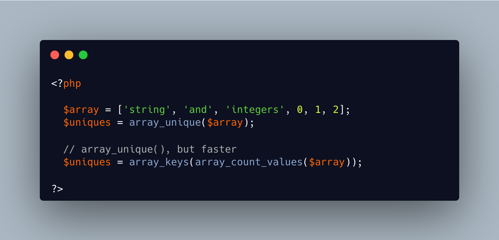

.. _array_unique-is-slow:

array_unique() Is Slow
----------------------

.. meta::
	:description:
		array_unique() Is Slow: Why is array_unique() still slower than using a combinaison of array_count_values() and array_keys.
	:twitter:card: summary_large_image
	:twitter:site: @exakat
	:twitter:title: array_unique() Is Slow
	:twitter:description: array_unique() Is Slow: Why is array_unique() still slower than using a combinaison of array_count_values() and array_keys
	:twitter:creator: @exakat
	:twitter:image:src: https://php-tips.readthedocs.io/en/latest/_images/array_unique_is_slow.png
	:og:image: https://php-tips.readthedocs.io/en/latest/_images/array_unique_is_slow.png
	:og:title: array_unique() Is Slow
	:og:type: article
	:og:description: Why is array_unique() still slower than using a combinaison of array_count_values() and array_keys
	:og:url: https://php-tips.readthedocs.io/en/latest/tips/array_unique_is_slow.html
	:og:locale: en

.. raw:: html

	

Why is array_unique() still slower than using a combinaison of array_count_values() and array_keys? And by an order of magnitude.

Limitations includes that the array can only use integers and strings, so no objects or other arrays (no one should anyway), or floats, boolean and nulls (harder to weed out).

And, of course, the alternative is not actually readable.

See Also
________

* `array_unique() <https://www.php.net/manual/en/function.array-unique.php>`_
* `array_count_values() <https://www.php.net/manual/en/function.array-count-values.php>`_
* `array_unique(), but faster <https://3v4l.org/mCTDV#v>`_ [Try me]

PHP Features
____________

* `array_unique <https://php-dictionary.readthedocs.io/en/latest/dictionary/array_unique.ini.html>`_

* `integer <https://php-dictionary.readthedocs.io/en/latest/dictionary/integer.ini.html>`_

* `string <https://php-dictionary.readthedocs.io/en/latest/dictionary/string.ini.html>`_

