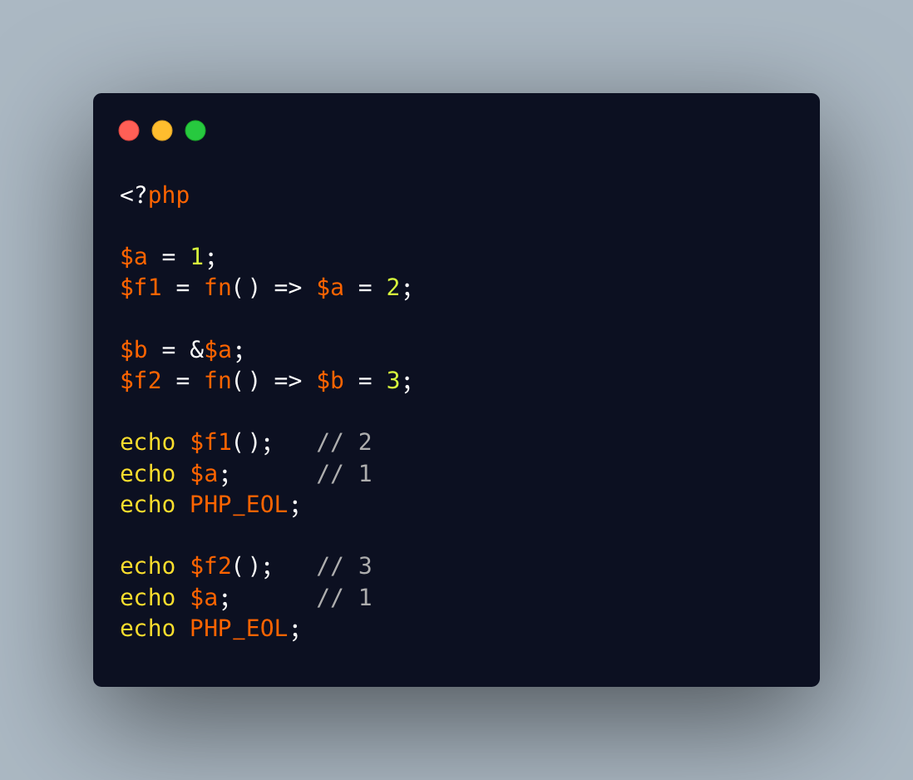

.. _arrow-functions-import-variables-by-values:

Arrow Functions Import Variables By Values
------------------------------------------

.. meta::
	:description:
		Arrow Functions Import Variables By Values: Arrow functions automatically import the variables from the current context, to be used in its returned expression.
	:twitter:card: summary_large_image
	:twitter:site: @exakat
	:twitter:title: Arrow Functions Import Variables By Values
	:twitter:description: Arrow Functions Import Variables By Values: Arrow functions automatically import the variables from the current context, to be used in its returned expression
	:twitter:creator: @exakat
	:twitter:image:src: https://php-tips.readthedocs.io/en/latest/_images/arrowFunctionsImportVariables.png
	:og:image: https://php-tips.readthedocs.io/en/latest/_images/arrowFunctionsImportVariables.png
	:og:title: Arrow Functions Import Variables By Values
	:og:type: article
	:og:description: Arrow functions automatically import the variables from the current context, to be used in its returned expression
	:og:url: https://php-tips.readthedocs.io/en/latest/tips/arrowFunctionsImportVariables.html
	:og:locale: en

.. raw:: html

	

Arrow functions automatically import the variables from the current context, to be used in its returned expression. It is still possible to assign a variable in such situation, by using an assignation in the return statemeent.

Yet, this does nothing, as the variable is imported by value, even when it is a reference in the first place. Hence, reading it access its value, but modifying it has no impact on the original context.

If the reference is important, the alternative is to use a closure, with a reference in the ``use(&$a)`` clause.

See Also
________

* `arrow-functions with references <https://3v4l.org/SZdGS>`_ [Try me]

