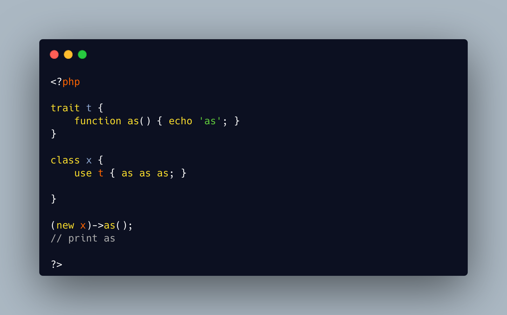

.. _as-as-as:

As As As
--------

.. meta::
	:description:
		As As As: 1) it is possible to call a method 'as', because relaxed keywords PHP methods.

1) it is possible to call a method 'as', because relaxed keywords PHP methods

2) it is possible to import a method from a trait, and alias it to itself.

It is possible to write 'as as as ' in PHP and make sense.

* `Multiple Traits (PHP manual) <https://www.php.net/manual/en/language.oop5.traits.php#language.oop5.traits.multiple>`_

