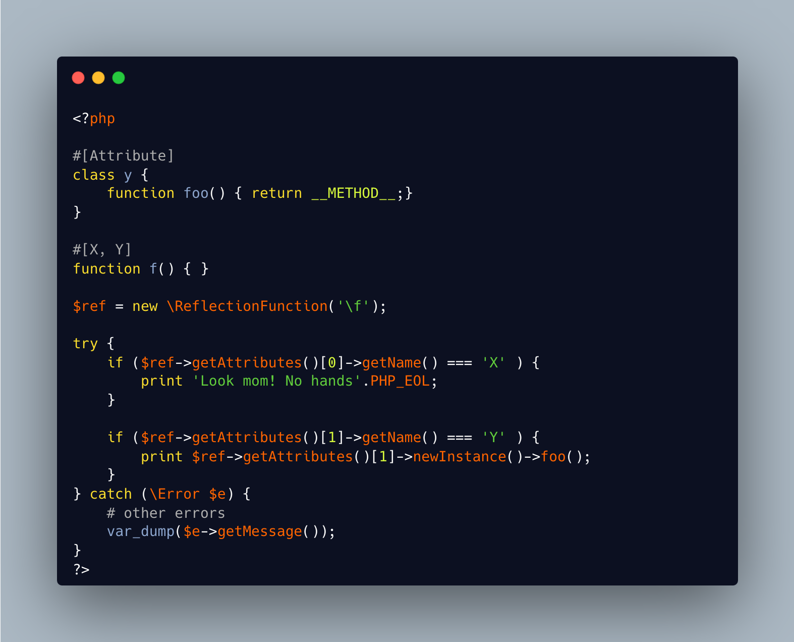

.. _attribute-without-class:

Attribute Without Class
-----------------------

.. meta::
	:description:
		Attribute Without Class: PHP 8.
	:twitter:card: summary_large_image
	:twitter:site: @exakat
	:twitter:title: Attribute Without Class
	:twitter:description: Attribute Without Class: PHP 8
	:twitter:creator: @exakat
	:twitter:image:src: https://php-tips.readthedocs.io/en/latest/_images/attribute_without_class.png
	:og:image: https://php-tips.readthedocs.io/en/latest/_images/attribute_without_class.png
	:og:title: Attribute Without Class
	:og:type: article
	:og:description: PHP 8
	:og:url: https://php-tips.readthedocs.io/en/latest/tips/attribute_without_class.html
	:og:locale: en

.. raw:: html

	

PHP 8.0 has an attribute feature, where extra options may be attached to various structures. The option is defined as a class, and is accessible via the Reflection API, and the getAttribute() method.

The attribute class is not necessary, per se. As long at the attribute is not instanciated, it is possible to rely only on the name of the attribute to handle specific behaviors.

See Also
________

* `Attributes overview (PHP manual) <https://www.php.net/manual/en/language.attributes.overview.php>`_
* `Attribute Without Class on 3v4l.org <https://3v4l.org/jc7gE>`_

