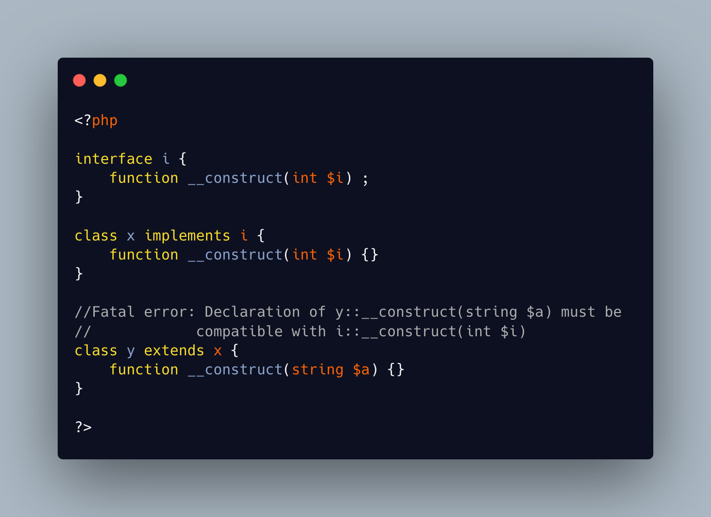

.. _battle-of-definition:

Battle Of Definition
--------------------

.. meta::
	:description:
		Battle Of Definition: Methods signatures must be compatible with the parent class's definition.
	:twitter:card: summary_large_image
	:twitter:site: @exakat
	:twitter:title: Battle Of Definition
	:twitter:description: Battle Of Definition: Methods signatures must be compatible with the parent class's definition
	:twitter:creator: @exakat
	:twitter:image:src: https://php-tips.readthedocs.io/en/latest/_images/battle_of_definitions.png
	:og:image: https://php-tips.readthedocs.io/en/latest/_images/battle_of_definitions.png
	:og:title: Battle Of Definition
	:og:type: article
	:og:description: Methods signatures must be compatible with the parent class's definition
	:og:url: https://php-tips.readthedocs.io/en/latest/tips/battle_of_definitions.html
	:og:locale: en

.. raw:: html

	

Methods signatures must be compatible with the parent class's definition. This is true, except for ``__construct()``, for which the compatibility is never checked.

Yet, compatibility is still enforced when the ``__construct()`` definition is in an interface. Then, both the implementing table and all its children must have the interface's compatibility.

See Also
________

* `Battle of definitions <https://3v4l.org/5qeE1>`_ [Try me]
* `3v4l : __construct() signature enforced when in an interface <https://3v4l.org/QPaRG>`_ [Try me]

PHP Features
____________

* `constructor <https://php-dictionary.readthedocs.io/en/latest/dictionary/constructor.ini.html>`_

* `compatibility <https://php-dictionary.readthedocs.io/en/latest/dictionary/compatibility.ini.html>`_

* `interface <https://php-dictionary.readthedocs.io/en/latest/dictionary/interface.ini.html>`_

* `signature <https://php-dictionary.readthedocs.io/en/latest/dictionary/signature.ini.html>`_

