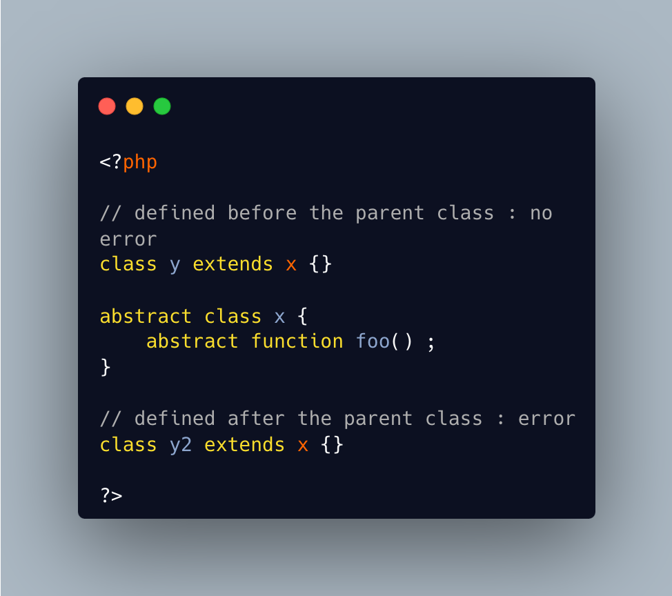

.. _declared-before-or-after:

Declared Before Or After
------------------------

.. meta::
	:description:
		Declared Before Or After: PHP takes the opportunity to validate everything it can when it is handy, and leave the rest to execution time.
	:twitter:card: summary_large_image
	:twitter:site: @exakat
	:twitter:title: Declared Before Or After
	:twitter:description: Declared Before Or After: PHP takes the opportunity to validate everything it can when it is handy, and leave the rest to execution time
	:twitter:creator: @exakat
	:twitter:image:src: https://php-tips.readthedocs.io/en/latest/_images/before_after.png
	:og:image: https://php-tips.readthedocs.io/en/latest/_images/before_after.png
	:og:title: Declared Before Or After
	:og:type: article
	:og:description: PHP takes the opportunity to validate everything it can when it is handy, and leave the rest to execution time
	:og:url: https://php-tips.readthedocs.io/en/latest/tips/before_after.html
	:og:locale: en

.. raw:: html

	

PHP takes the opportunity to validate everything it can when it is handy, and leave the rest to execution time. In the code below, the first class has no error reported, because it is linted before the parent class. The last class displays an error because it appears after the definition of the parent, and PHP can lazily check it.

The validation of the first class will be more thorough at execution time, and yield the error then.

See Also
________

* `Order Of Declaration Is Lintable <https://3v4l.org/mUEsK>`_ [Try me]

PHP Error Messages
__________________

* `Class %s contains %d abstract method%s and must therefore be declared abstract or implement the remaining methods <https://php-errors.readthedocs.io/en/latest/messages/class-%25s-contains-%25d-abstract-method%25s-and-must-therefore-be-declared-abstract-or-implement-the-remaining-methods.html>`_

PHP Features
____________

* `linting <https://php-dictionary.readthedocs.io/en/latest/dictionary/linting.ini.html>`_

* `lint-wont-execute <https://php-dictionary.readthedocs.io/en/latest/dictionary/lint-wont-execute.ini.html>`_

