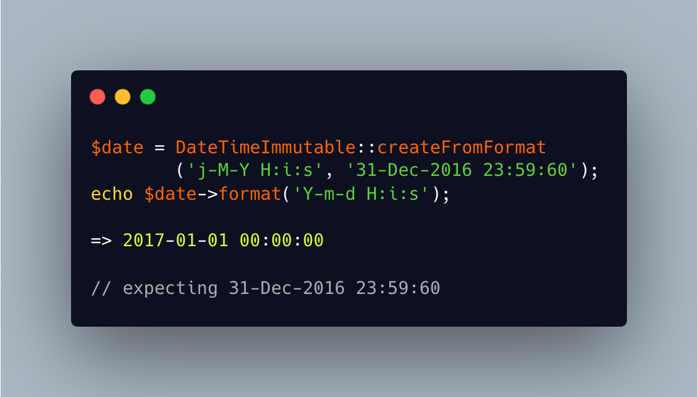

.. _datetime-and-leap-second:

Datetime And Leap Second
------------------------

.. meta::
	:description:
		Datetime And Leap Second: The last leap second was added on 2016, Dec 31rst.
	:twitter:card: summary_large_image
	:twitter:site: @exakat
	:twitter:title: Datetime And Leap Second
	:twitter:description: Datetime And Leap Second: The last leap second was added on 2016, Dec 31rst
	:twitter:creator: @exakat
	:twitter:image:src: https://php-tips.readthedocs.io/en/latest/_images/beyond_datetime.png
	:og:image: https://php-tips.readthedocs.io/en/latest/_images/beyond_datetime.png
	:og:title: Datetime And Leap Second
	:og:type: article
	:og:description: The last leap second was added on 2016, Dec 31rst
	:og:url: https://php-tips.readthedocs.io/en/latest/tips/beyond_datetime.html
	:og:locale: en

.. raw:: html

	

The last leap second was added on 2016, Dec 31rst. On that day, 23:59:60 existed, and was followed by 00:00:00 on the first of January. The date time do not handle this, rand rather convert the ``60`` seconds into the next day, silently.

In fact, hours, minuts, seconds and day of the month, all support 2 digits, and accept values up to 99: they are all converted silently to their equivalent date, as if time of that duration passed.

Leap years, on the other hand, are all well supported.

See Also
________

* `Leap Second <https://en.wikipedia.org/wiki/Leap_second>`_
* `99s after midnight <https://3v4l.org/pXq0Q#veol>`_ [Try me]

PHP Features
____________

* `silent <https://php-dictionary.readthedocs.io/en/latest/dictionary/silent.ini.html>`_

* `datetime <https://php-dictionary.readthedocs.io/en/latest/dictionary/datetime.ini.html>`_

* `edge-case <https://php-dictionary.readthedocs.io/en/latest/dictionary/edge-case.ini.html>`_

