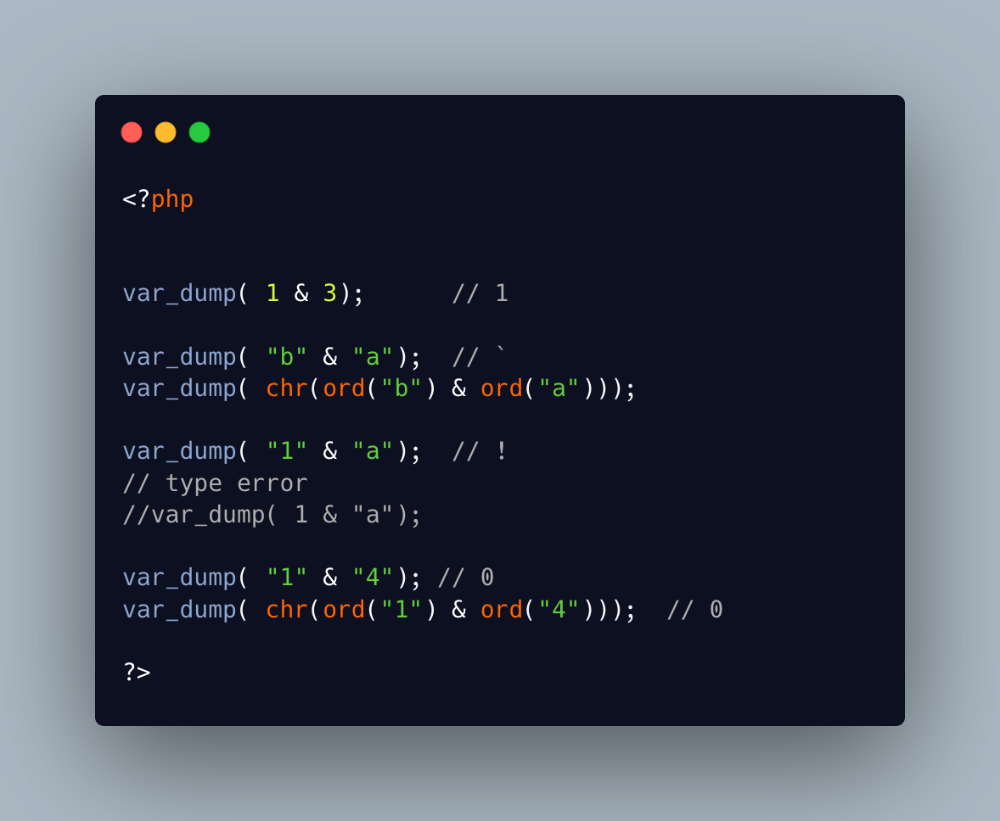

.. _bitwise-operations-on-string:

Bitwise Operations On String
----------------------------

.. meta::
	:description:
		Bitwise Operations On String: The bit operators ``&``, ``|`` and ``^`` work on integers, and use the numbers as a bitfield: each bit in the numbers are compared with the operator, and set accordingly in the result.
	:twitter:card: summary_large_image
	:twitter:site: @exakat
	:twitter:title: Bitwise Operations On String
	:twitter:description: Bitwise Operations On String: The bit operators ``&``, ``|`` and ``^`` work on integers, and use the numbers as a bitfield: each bit in the numbers are compared with the operator, and set accordingly in the result
	:twitter:creator: @exakat
	:twitter:image:src: https://php-tips.readthedocs.io/en/latest/_images/bit_operation_on_string.png
	:og:image: https://php-tips.readthedocs.io/en/latest/_images/bit_operation_on_string.png
	:og:title: Bitwise Operations On String
	:og:type: article
	:og:description: The bit operators ``&``, ``|`` and ``^`` work on integers, and use the numbers as a bitfield: each bit in the numbers are compared with the operator, and set accordingly in the result
	:og:url: https://php-tips.readthedocs.io/en/latest/tips/bit_operation_on_string.html
	:og:locale: en

.. raw:: html

	

The bit operators ``&``, ``|`` and ``^`` work on integers, and use the numbers as a bitfield: each bit in the numbers are compared with the operator, and set accordingly in the result.

The same operators works on strings, where the string is treated as a binary data.

Since PHP 8.0, it is an error to have different types on both sides of the bit operators. Other types are also yielding an error, like with arrays, objects, etc.

When in doubt, consider using the logical operators.

See Also
________

* `Bitwise Operators <https://www.php.net/manual/en/language.operators.bitwise.php>`_
* `& on integers and strings <https://3v4l.org/Kkepg>`_ [Try me]

PHP Error Messages
__________________

* `Unsupported operand types: int & string <https://php-errors.readthedocs.io/en/latest/messages/unsupported-operand-types%3A-%25s-%25s-%25s.html>`_

PHP Features
____________

* `bitwise-operator <https://php-dictionary.readthedocs.io/en/latest/dictionary/bitwise-operator.ini.html>`_

* `string <https://php-dictionary.readthedocs.io/en/latest/dictionary/string.ini.html>`_

* `integer <https://php-dictionary.readthedocs.io/en/latest/dictionary/integer.ini.html>`_

