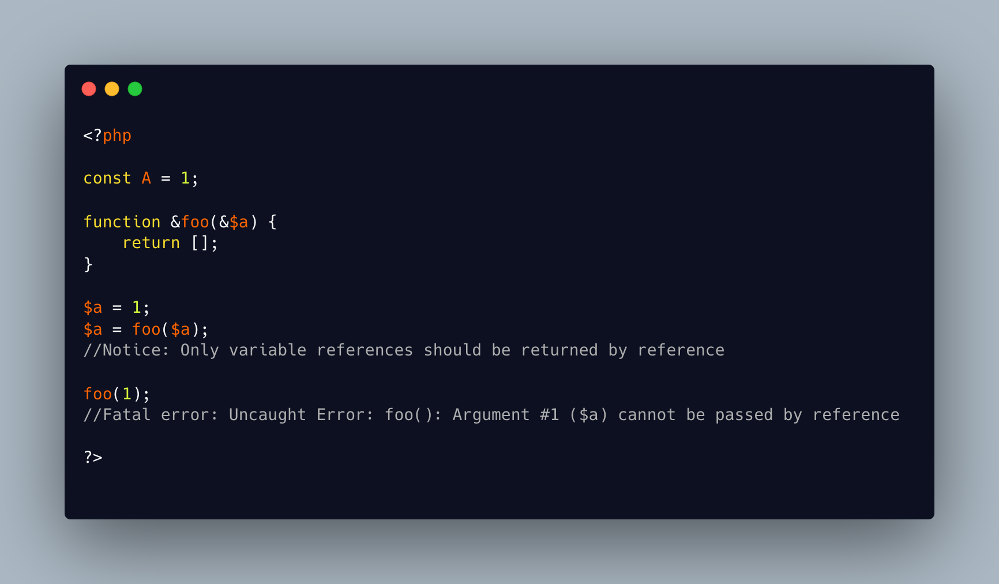

.. _by-reference,-error-or-notice?:

By Reference, Error Or Notice?
------------------------------

.. meta::
	:description:
		By Reference, Error Or Notice?: Passing a literal by reference to a method causes a Fatal error, while returning a literal by reference only triggers a Notice.
	:twitter:card: summary_large_image
	:twitter:site: @exakat
	:twitter:title: By Reference, Error Or Notice?
	:twitter:description: By Reference, Error Or Notice?: Passing a literal by reference to a method causes a Fatal error, while returning a literal by reference only triggers a Notice
	:twitter:creator: @exakat
	:twitter:image:src: https://php-tips.readthedocs.io/en/latest/_images/by_reference_errors.png
	:og:image: https://php-tips.readthedocs.io/en/latest/_images/by_reference_errors.png
	:og:title: By Reference, Error Or Notice?
	:og:type: article
	:og:description: Passing a literal by reference to a method causes a Fatal error, while returning a literal by reference only triggers a Notice
	:og:url: https://php-tips.readthedocs.io/en/latest/tips/by_reference_errors.html
	:og:locale: en

.. raw:: html

	

Passing a literal by reference to a method causes a Fatal error, while returning a literal by reference only triggers a Notice. This difference in error level is puzzling, given how similar the operations are. It raises the question: why does one completely halt execution, while the other merely issues a warning and continues running?

See Also
________

* `Passing By Reference (PHP manual) <https://www.php.net/manual/en/language.references.pass.php>`_
* `By reference or by value? <https://3v4l.org/6knLV>`_ [Try me]

PHP Features
____________

* `reference <https://php-dictionary.readthedocs.io/en/latest/dictionary/reference.ini.html>`_

* `return <https://php-dictionary.readthedocs.io/en/latest/dictionary/return.ini.html>`_

* `notice <https://php-dictionary.readthedocs.io/en/latest/dictionary/notice.ini.html>`_

