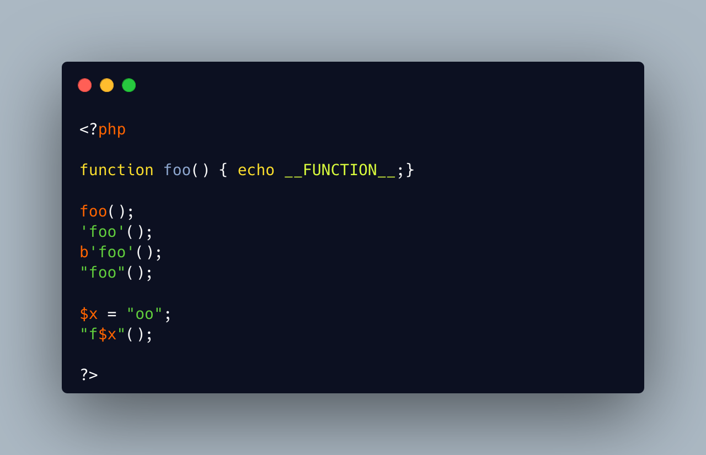

.. _call-function-with-strings:

Call Function With Strings
--------------------------

.. meta::
	:description:
		Call Function With Strings: Usually, a function is called with its name as first element of the syntax.
	:twitter:card: summary_large_image
	:twitter:site: @exakat
	:twitter:title: Call Function With Strings
	:twitter:description: Call Function With Strings: Usually, a function is called with its name as first element of the syntax
	:twitter:creator: @exakat
	:twitter:image:src: https://php-tips.readthedocs.io/en/latest/_images/call_function_with_strings.png.png
	:og:image: https://php-tips.readthedocs.io/en/latest/_images/call_function_with_strings.png
	:og:title: Call Function With Strings
	:og:type: article
	:og:description: Usually, a function is called with its name as first element of the syntax
	:og:url: https://php-tips.readthedocs.io/en/latest/tips/call_function_with_strings.html
	:og:locale: en

Usually, a function is called with its name as first element of the syntax.

And it is also possible to use a string, either in a variable or directly as a literal. This means that adding single or double quotes to the name of a function is still a valid syntax.

Of course, there is still the left over binary string of PHP 6, so it is also possible to add an initial ``b`` to the string.

Then, the double quoted strings accepts interpolated variables, to make the call dynamic.

Finally, it is not possible to use the HereDoc syntax, as parenthesis are not allowed directly after the closing tag.

* `Function (PHP manual) <https://www.php.net/manual/en/language.functions.php>`_

