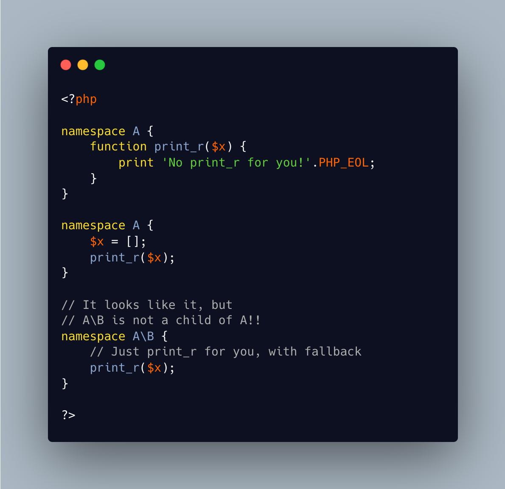

.. _cancelling-native-function:

Cancelling Native Function
--------------------------

.. meta::
	:description:
		Cancelling Native Function: PHP native functions are part of the global scope.
	:twitter:card: summary_large_image
	:twitter:site: @exakat
	:twitter:title: Cancelling Native Function
	:twitter:description: Cancelling Native Function: PHP native functions are part of the global scope
	:twitter:creator: @exakat
	:twitter:image:src: https://php-tips.readthedocs.io/en/latest/_images/cancelling_native_function.png
	:og:image: https://php-tips.readthedocs.io/en/latest/_images/cancelling_native_function.png
	:og:title: Cancelling Native Function
	:og:type: article
	:og:description: PHP native functions are part of the global scope
	:og:url: https://php-tips.readthedocs.io/en/latest/tips/cancelling_native_function.html
	:og:locale: en

.. raw:: html

	

PHP native functions are part of the global scope. In a custom namespace, the local definition of a function has priority. And when this fails, PHP fallbacks to the global space. This is a backward compatibility process, that prevents developer from adding ALL native PHP functions as a ``use`` expression in every file. This would be long, boring and a performance boost.

To cancel a PHP native function, such as ``print_r`` or ``var_dump``, the trick is to create a definition of that function in the same namespace. It is then used with precedence, and may be prevented from having any impact.

This would be different from using the ``disable_functions``: then, the function undefined, and shall be defined again, in the global namespace, to be properly neutralized.

This trick does not work with classes.

See Also
________

* `Namespaces (PHP manual) <https://www.php.net/manual/en/language.namespaces.php>`_
* `disable print_r() in namespace <https://3v4l.org/nuUL6>`_

