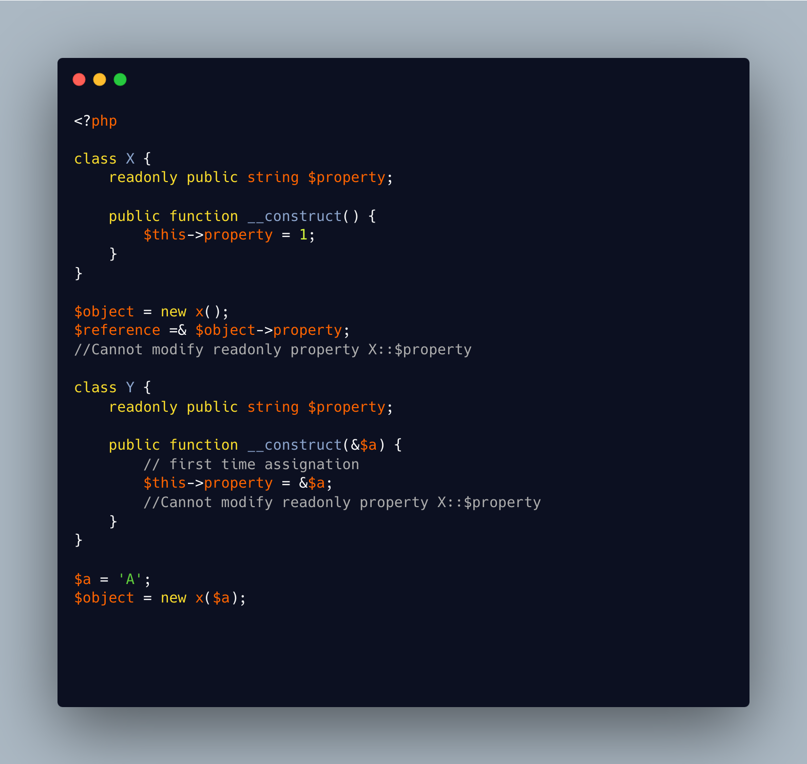

.. _cannot-indirectly-modify-readonly:

Cannot indirectly modify readonly
---------------------------------

.. meta::
	:description:
		Cannot indirectly modify readonly: The same error message 'Cannot indirectly modify readonly property X::$property' is used when trying to sneak a reference on a readonly property, and updated it later.
	:twitter:card: summary_large_image
	:twitter:site: @exakat
	:twitter:title: Cannot indirectly modify readonly
	:twitter:description: Cannot indirectly modify readonly: The same error message 'Cannot indirectly modify readonly property X::$property' is used when trying to sneak a reference on a readonly property, and updated it later
	:twitter:creator: @exakat
	:twitter:image:src: https://php-tips.readthedocs.io/en/latest/_images/cannot-initialy-modify-readonly.png
	:og:image: https://php-tips.readthedocs.io/en/latest/_images/cannot-initialy-modify-readonly.png
	:og:title: Cannot indirectly modify readonly
	:og:type: article
	:og:description: The same error message 'Cannot indirectly modify readonly property X::$property' is used when trying to sneak a reference on a readonly property, and updated it later
	:og:url: https://php-tips.readthedocs.io/en/latest/tips/cannot-initialy-modify-readonly.html
	:og:locale: en

.. raw:: html

	

The same error message 'Cannot indirectly modify readonly property X::$property' is used when trying to sneak a reference on a readonly property, and updated it later.

Strangely, this is also the same error message when the readonly property is initially assigned a reference, for later sneaky update.

The error is the same, indeed, yet may be these messages may be distinct.

See Also
________

* `Properties (PHP manual) <https://www.php.net/manual/en/language.oop5.properties.php>`_
* `Sneaky readonly <https://3v4l.org/jNtaT>`_

PHP Error Messages
__________________

* `Cannot indirectly modify readonly property %s::$%s <https://php-errors.readthedocs.io/en/latest/messages/cannot-indirectly-modify-readonly-property-%25s%3A%3A%24%25s.html>`_

