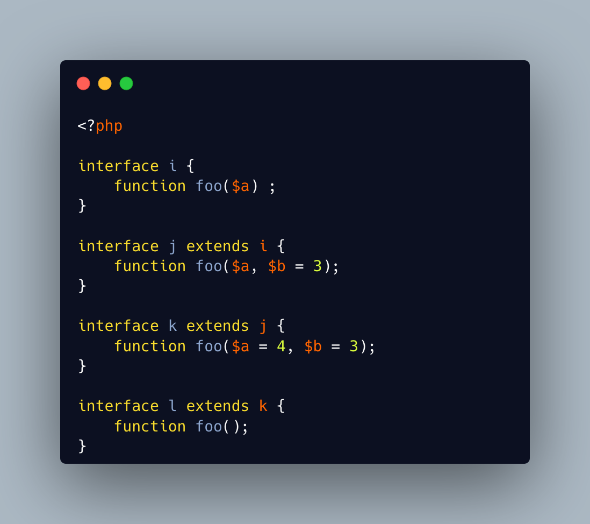

.. _can't-be-compatible-with-less-arguments:

Can't Be Compatible With Less Arguments
---------------------------------------

.. meta::
	:description:
		Can't Be Compatible With Less Arguments: A method is compatible with its parent's version when it has at least the same number of arguments.
	:twitter:card: summary_large_image
	:twitter:site: @exakat
	:twitter:title: Can't Be Compatible With Less Arguments
	:twitter:description: Can't Be Compatible With Less Arguments: A method is compatible with its parent's version when it has at least the same number of arguments
	:twitter:creator: @exakat
	:twitter:image:src: https://php-tips.readthedocs.io/en/latest/_images/cantBeBackCompatible.png
	:og:image: https://php-tips.readthedocs.io/en/latest/_images/cantBeBackCompatible.png
	:og:title: Can't Be Compatible With Less Arguments
	:og:type: article
	:og:description: A method is compatible with its parent's version when it has at least the same number of arguments
	:og:url: https://php-tips.readthedocs.io/en/latest/tips/cantBeBackCompatible.html
	:og:locale: en

.. raw:: html

	

A method is compatible with its parent's version when it has at least the same number of arguments. This is valid with classes, but also with interfaces.

A child method is compatible with its parent when adding a new argument, as long as the argument as a default value.

Another child may also be compatible by adding a default value to the existing argument. At that point, calling the method without any argument is now a valid call.

Yet, it is not possible to rewrite the method without arguments because it would be incompatible with the method definition of the parent, even though it is always possible to call both versions the same way.

See Also
________

* `compatible, but not so much <https://3v4l.org/u4p3g>`_ [Try me]

PHP Error Messages
__________________

* `Declaration of %s::%s() must be compatible with %s::%s <https://php-errors.readthedocs.io/en/latest/messages/declaration-of-%25s%3A%3A%25s%28%29-must-be-compatible-with-%25s%3A%3A%25s%28%29.html>`_

PHP Features
____________

* `method-compatibility <https://php-dictionary.readthedocs.io/en/latest/dictionary/method-compatibility.ini.html>`_

* `interface <https://php-dictionary.readthedocs.io/en/latest/dictionary/interface.ini.html>`_

