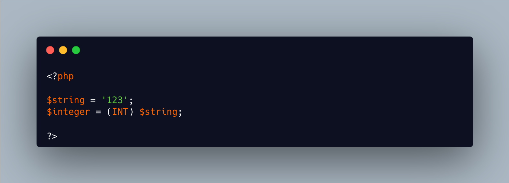

.. _case-insensitive-cast:

Case Insensitive Cast
---------------------

.. meta::
	:description:
		Case Insensitive Cast: PHP's cast operators are case insensitive.
	:twitter:card: summary_large_image
	:twitter:site: @exakat
	:twitter:title: Case Insensitive Cast
	:twitter:description: Case Insensitive Cast: PHP's cast operators are case insensitive
	:twitter:creator: @exakat
	:twitter:image:src: https://php-tips.readthedocs.io/en/latest/_images/case_insensitive_cast.png
	:og:image: https://php-tips.readthedocs.io/en/latest/_images/case_insensitive_cast.png
	:og:title: Case Insensitive Cast
	:og:type: article
	:og:description: PHP's cast operators are case insensitive
	:og:url: https://php-tips.readthedocs.io/en/latest/tips/case_insensitive_cast.html
	:og:locale: en

.. raw:: html

	

PHP's cast operators are case insensitive. ``(int)``, ``(INT)`` and all variations, like ``(iNt)`` are possible. The usual convention is to use the all lower case syntax for the operators, and any other usage is extremely rare.

See Also
________

* `Type Juggling <https://www.php.net/manual/en/language.types.type-juggling.php>`_

