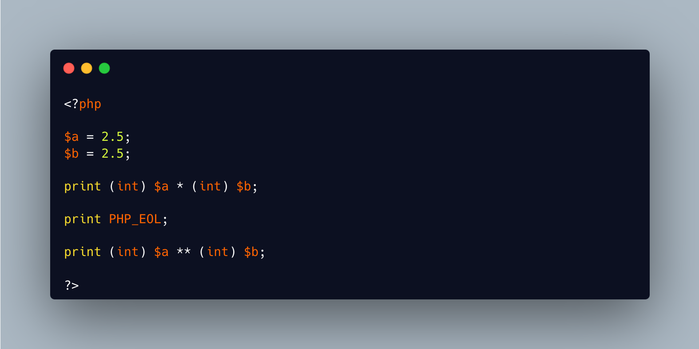

.. _casting-and-power:

Casting And Power
-----------------

.. meta::
	:description:
		Casting And Power: When you know that 2*2 = 4, and 2**2 = 4 (too), and 2.
	:twitter:card: summary_large_image
	:twitter:site: @exakat
	:twitter:title: Casting And Power
	:twitter:description: Casting And Power: When you know that 2*2 = 4, and 2**2 = 4 (too), and 2
	:twitter:creator: @exakat
	:twitter:image:src: https://php-tips.readthedocs.io/en/latest/_images/cast_and_power.png
	:og:image: https://php-tips.readthedocs.io/en/latest/_images/cast_and_power.png
	:og:title: Casting And Power
	:og:type: article
	:og:description: When you know that 2*2 = 4, and 2**2 = 4 (too), and 2
	:og:url: https://php-tips.readthedocs.io/en/latest/tips/cast_and_power.html
	:og:locale: en

.. raw:: html

	

When you know that 2*2 = 4, and 2**2 = 4 (too), and 2.5 ** 2.5 = 9.8821176880262, have to ask yourself where is this 6 coming from.

The answer is in the precedence. Casting has higher precedence than multiplication, so cast is done first (2.5 -> 2) then multiplication. This gives the first 4. 

Then, power, ``**``, as higher precedence than casting, so the second expression gives first 2.5 ** 2, which is 6.25, and then, cast it again as an integer, hence 6.

It's a good thing that power is so little used.

See Also
________

* `Operator Precedence (PHP manual) <https://www.php.net/manual/en/language.operators.precedence.php>`_
* `Cast And Power <https://3v4l.org/ciEvM>`_ [Try me]

PHP Error Messages
__________________

PHP Features
____________

* `cast <https://php-dictionary.readthedocs.io/en/latest/dictionary/cast.ini.html>`_

* `exponent <https://php-dictionary.readthedocs.io/en/latest/dictionary/exponent.ini.html>`_

