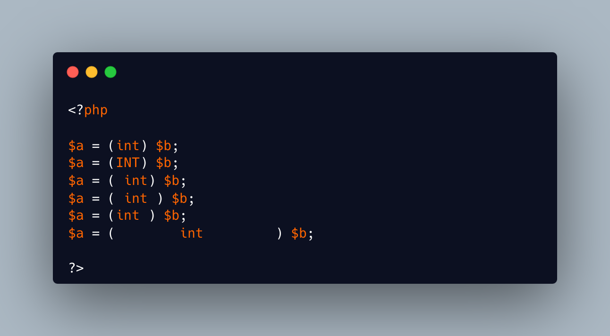

.. _cast-are-case-insensitive:

Cast Are Case Insensitive
-------------------------

.. meta::
	:description:
		Cast Are Case Insensitive: Today I learned that PHP cast operators like ``(int)`` and ``(array)`` are case-insensitive—so ``(STRING)`` works just as well.
	:twitter:card: summary_large_image
	:twitter:site: @exakat
	:twitter:title: Cast Are Case Insensitive
	:twitter:description: Cast Are Case Insensitive: Today I learned that PHP cast operators like ``(int)`` and ``(array)`` are case-insensitive—so ``(STRING)`` works just as well
	:twitter:creator: @exakat
	:twitter:image:src: https://php-tips.readthedocs.io/en/latest/_images/cast_are_case_insensitive.png
	:og:image: https://php-tips.readthedocs.io/en/latest/_images/cast_are_case_insensitive.png
	:og:title: Cast Are Case Insensitive
	:og:type: article
	:og:description: Today I learned that PHP cast operators like ``(int)`` and ``(array)`` are case-insensitive—so ``(STRING)`` works just as well
	:og:url: https://php-tips.readthedocs.io/en/latest/tips/cast_are_case_insensitive.html
	:og:locale: en

.. raw:: html

	

Today I learned that PHP cast operators like ``(int)`` and ``(array)`` are case-insensitive—so ``(STRING)`` works just as well. Additionally, the amount of whitespace (spaces, tabs, etc.) around these casts doesn’t affect functionality. These aspects are flexible in PHP, and what remains—such as casing and spacing style—is largely a matter of coding convention and personal or team preference.

See Also
________

* `Type Operators (PHP manual) <https://www.php.net/manual/en/language.operators.type.php>`_
* `So much spaces... <https://3v4l.org/P5VcS>`_ [Try me]

PHP Features
____________

* `case-sensitivity <https://php-dictionary.readthedocs.io/en/latest/dictionary/case-sensitivity.ini.html>`_

* `whitespace <https://php-dictionary.readthedocs.io/en/latest/dictionary/whitespace.ini.html>`_

