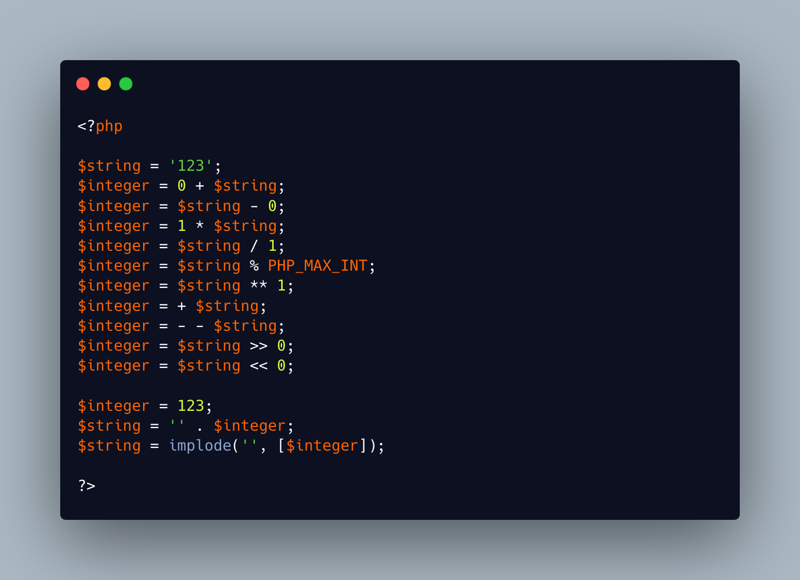

.. _cast-but-not-a-cast:

Cast But Not A Cast
-------------------

.. meta::
	:description:
		Cast But Not A Cast: One frequent way to convert a string to an integer is to ``+ 0`` it.
	:twitter:card: summary_large_image
	:twitter:site: @exakat
	:twitter:title: Cast But Not A Cast
	:twitter:description: Cast But Not A Cast: One frequent way to convert a string to an integer is to ``+ 0`` it
	:twitter:creator: @exakat
	:twitter:image:src: https://php-tips.readthedocs.io/en/latest/_images/cast_but_not_cast.png
	:og:image: https://php-tips.readthedocs.io/en/latest/_images/cast_but_not_cast.png
	:og:title: Cast But Not A Cast
	:og:type: article
	:og:description: One frequent way to convert a string to an integer is to ``+ 0`` it
	:og:url: https://php-tips.readthedocs.io/en/latest/tips/cast_but_not_cast.html
	:og:locale: en

.. raw:: html

	

One frequent way to convert a string to an integer is to ``+ 0`` it. And, similarly, a frequent way to convert an integer into a string is to ``. ''``, aka concatenate the empty string.

The operators often proceed with a silent cast before running the actual operation. Hence, when using the neutral element of that operator, only the cast remains.

Note also that the silent cast is actually not silent when there is an issue with the conversion, while an actual cast silences these warnings: it is always better to use the cast.

Here are the other cases.

See Also
________

* `cast, cast, cast and cast <https://3v4l.org/J6SM0>`_ [Try me]
* `Not so silent <https://3v4l.org/oZKZM>`_ [Try me]

PHP Error Messages
__________________

* `A non-numeric value encountered <https://php-errors.readthedocs.io/en/latest/messages/a-non-numeric-value-encountered.html>`_

PHP Features
____________

* `cast <https://php-dictionary.readthedocs.io/en/latest/dictionary/cast.ini.html>`_

* `neutral-element <https://php-dictionary.readthedocs.io/en/latest/dictionary/neutral-element.ini.html>`_

