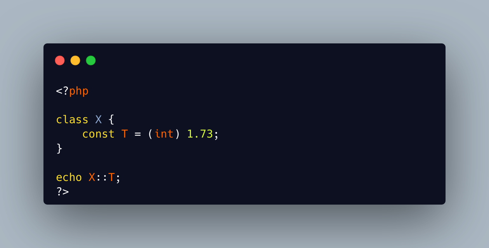

.. _cast-in-const:

Cast In Const
-------------

.. meta::
	:description:
		Cast In Const: TIL that constant values accepts casting since PHP 8.
	:twitter:card: summary_large_image
	:twitter:site: @exakat
	:twitter:title: Cast In Const
	:twitter:description: Cast In Const: TIL that constant values accepts casting since PHP 8
	:twitter:creator: @exakat
	:twitter:image:src: https://php-tips.readthedocs.io/en/latest/_images/cast_in_const.png
	:og:image: https://php-tips.readthedocs.io/en/latest/_images/cast_in_const.png
	:og:title: Cast In Const
	:og:type: article
	:og:description: TIL that constant values accepts casting since PHP 8
	:og:url: https://php-tips.readthedocs.io/en/latest/tips/cast_in_const.html
	:og:locale: en

.. raw:: html

	

TIL that constant values accepts casting since PHP 8.5. It is possible to cast a value to another type when defining the global or class constant.

This might be most useful when a constant must be available in several flavor, rather than with literal values.

The only cast that is not supported is ``(object)``.

See Also
________

* `Void (PHP manual) <https://www.php.net/manual/en/language.types.void.php>`_
* `cast in constant <https://3v4l.org/QnIDl>`_ [Try me]

PHP Error Messages
__________________

* `Object casts are not supported in this context <https://php-errors.readthedocs.io/en/latest/messages/object-casts-are-not-supported-in-this-context.html>`_

PHP Features
____________

* `cast <https://php-dictionary.readthedocs.io/en/latest/dictionary/cast.ini.html>`_

* `constant <https://php-dictionary.readthedocs.io/en/latest/dictionary/constant.ini.html>`_

* `class-constant <https://php-dictionary.readthedocs.io/en/latest/dictionary/class-constant.ini.html>`_

* `static-expression <https://php-dictionary.readthedocs.io/en/latest/dictionary/static-expression.ini.html>`_

