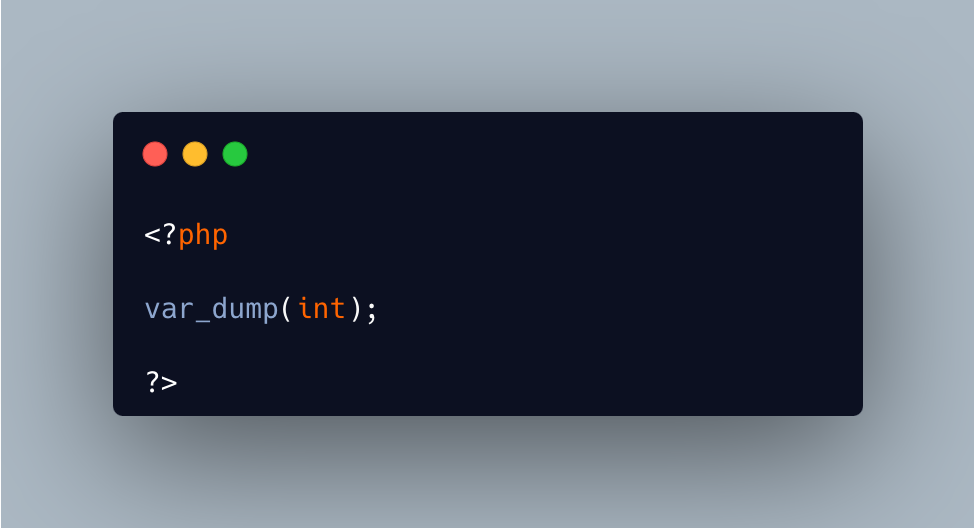

.. _cast-is-so-strong:

Cast Is So Strong
-----------------

.. meta::
	:description:
		Cast Is So Strong: The code below yields a Fatal Error, at linting time.
	:twitter:card: summary_large_image
	:twitter:site: @exakat
	:twitter:title: Cast Is So Strong
	:twitter:description: Cast Is So Strong: The code below yields a Fatal Error, at linting time
	:twitter:creator: @exakat
	:twitter:image:src: https://php-tips.readthedocs.io/en/latest/_images/cast_is_strong.png
	:og:image: https://php-tips.readthedocs.io/en/latest/_images/cast_is_strong.png
	:og:title: Cast Is So Strong
	:og:type: article
	:og:description: The code below yields a Fatal Error, at linting time
	:og:url: https://php-tips.readthedocs.io/en/latest/tips/cast_is_strong.html
	:og:locale: en

.. raw:: html

	

The code below yields a Fatal Error, at linting time. PHP identifies too early the cast operator ``(int)``, and fail to recognize the function call to ``var_dump()``.

It is possible to create a constant called ``int``, but it is not possible to put it between parenthesis, including with spaces. PHP always confuse it with the cast operator.

Later, ``bool``, ``float``, ``string``, ``array``, ``object`` all fail to parse for the same reasons. It is also the case for ``unset``, although this operator is not supported anymore. It is also the case for ``boolean``, and ``integer``, although PHP complains about the short name of the operator.

This issue has been with PHP since PHP 4.

See Also
________

* `Type Juggling <https://www.php.net/manual/en/language.types.type-juggling.php>`_
* `Example cast with int <https://3v4l.org/moVUK>`_ [Try me]

PHP Error Messages
__________________

* `syntax error, unexpected token "(int)" <https://php-errors.readthedocs.io/en/latest/messages/syntax-error%2C-unexpected-token-%22%28int%29%22.html>`_

PHP Features
____________

* `cast <https://php-dictionary.readthedocs.io/en/latest/dictionary/cast.ini.html>`_

* `linting <https://php-dictionary.readthedocs.io/en/latest/dictionary/linting.ini.html>`_

