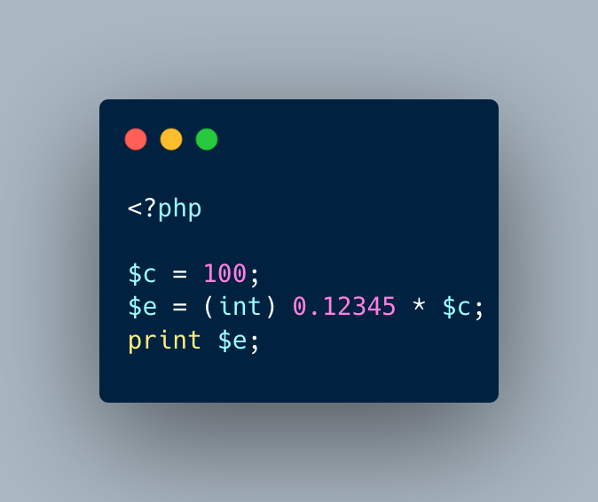

.. _cast-precedence:

Cast Precedence
---------------

	.. meta::
		:description lang=en:
			Cast Precedence: Casting has a higher precedence than multiplication (and addition).

Casting has a higher precedence than multiplication (and addition). Here, the cast on the float happens first, which leads to 0. This 0 is later multiplied by 100, and that still gives 0.

If $c was the first operand, it would be cast first to integer, with no impact, and then multiplied: that leads to a float value, even with the cast.

* `Operator Precedence <https://www.php.net/manual/en/language.operators.precedence.php>`_
* `Reverse illustration <https://3v4l.org/JIP0g>`_

