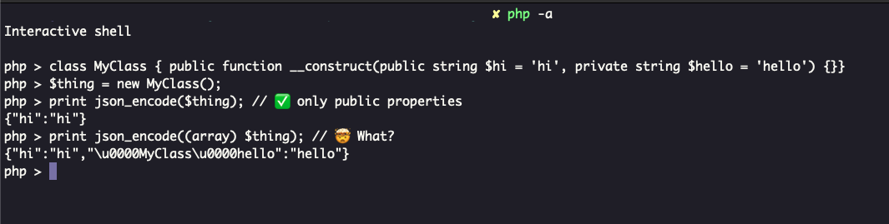

.. _cast-private-to-array:

Cast Private To Array
---------------------

.. meta::
	:description:
		Cast Private To Array: Today I learned that PHP exposes private properties when an object is casted to an array.
	:twitter:card: summary_large_image
	:twitter:site: @exakat
	:twitter:title: Cast Private To Array
	:twitter:description: Cast Private To Array: Today I learned that PHP exposes private properties when an object is casted to an array
	:twitter:creator: @exakat
	:twitter:image:src: https://php-tips.readthedocs.io/en/latest/_images/cast_private_to_array.png
	:og:image: https://php-tips.readthedocs.io/en/latest/_images/cast_private_to_array.png
	:og:title: Cast Private To Array
	:og:type: article
	:og:description: Today I learned that PHP exposes private properties when an object is casted to an array
	:og:url: https://php-tips.readthedocs.io/en/latest/tips/cast_private_to_array.html
	:og:locale: en

.. raw:: html

	

By `Paul Shryock <https://phpc.social/@paulshryock>`_

Today I learned that PHP exposes private properties when an object is casted to an array. 🤦.

See Also
________

* `Original Toot <https://phpc.social/@paulshryock/114717288186291609>`_
* `Casting private properties <https://3v4l.org/AfOPT>`_ [Try me]

PHP Features
____________

* `cast <https://php-dictionary.readthedocs.io/en/latest/dictionary/cast.ini.html>`_

