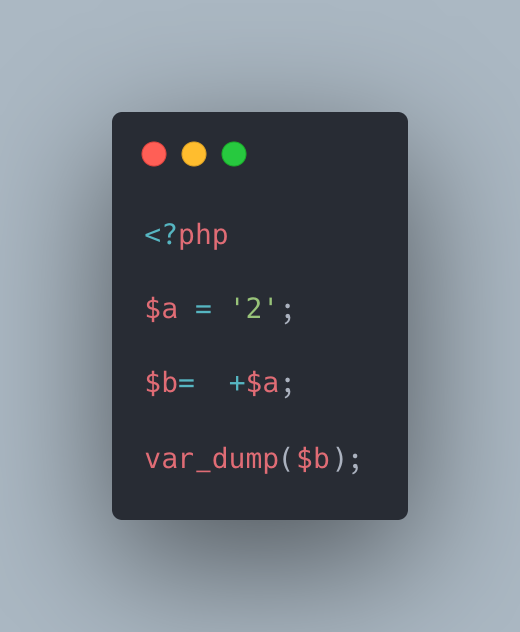

.. _another-cast-to-int:

Another Cast To Int
-------------------

.. meta::
	:description:
		Another Cast To Int: Another way to cast a value to int, besides the obvious (int) and the classic ``+ 0``, is to use the ``+`` operator on a variable.
	:twitter:card: summary_large_image
	:twitter:site: @exakat
	:twitter:title: Another Cast To Int
	:twitter:description: Another Cast To Int: Another way to cast a value to int, besides the obvious (int) and the classic ``+ 0``, is to use the ``+`` operator on a variable
	:twitter:creator: @exakat
	:twitter:image:src: https://php-tips.readthedocs.io/en/latest/_images/cast_to_int.png.png
	:og:image: https://php-tips.readthedocs.io/en/latest/_images/cast_to_int.png
	:og:title: Another Cast To Int
	:og:type: article
	:og:description: Another way to cast a value to int, besides the obvious (int) and the classic ``+ 0``, is to use the ``+`` operator on a variable
	:og:url: https://php-tips.readthedocs.io/en/latest/tips/cast_to_int.html
	:og:locale: en

Another way to cast a value to int, besides the obvious (int) and the classic ``+ 0``, is to use the ``+`` operator on a variable.

